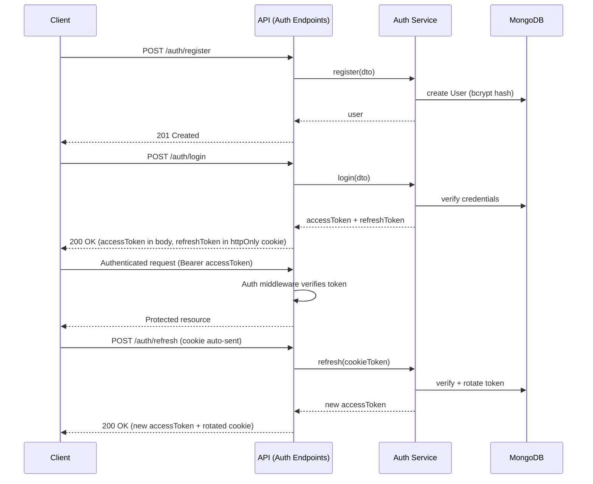

# API Specification — Expense Splitter (Enhanced)

**Phase:** 1 — System Design
**Milestone:** 1.5 (Production Hardening Upgrade)
**Status:** Draft
**Depends on:** SYSTEM_ARCHITECTURE.md, FRONTEND_ARCHITECTURE.md, BACKEND_ARCHITECTURE.md, DATABASE_DESIGN.md, SECURITY_ARCHITECTURE.md (frozen)

> **Upgrade note:** this revision adds eight production-hardening sections (contract governance, pagination standard, error registry, request traceability, idempotency, documentation strategy, health checks, media upload direction) to the already-approved API contract. No existing endpoint's method, route, request/response shape, or authorization rule has changed. A consistency audit against every frozen document is included at the end.

---

## 1. API Architecture

The API is a single REST surface, consumed exclusively by the React frontend (`FRONTEND_ARCHITECTURE.md`), following the request lifecycle already fixed in `BACKEND_ARCHITECTURE.md` Section 4: `Route → Middleware → Controller → Service → Repository → Model → Database`. This document defines the contract at the Route/Controller boundary — every endpoint below is a thin controller translating HTTP into exactly one service call, per that architecture.

**Base URL:** `https://api.<domain>/api/v1`

**Content type:** `application/json` for all request and response bodies, except the refresh token, which travels as an httpOnly cookie (never in a JSON body).

---

## 2. API Versioning Strategy

All routes are prefixed `/api/v1`, established now (per `BACKEND_ARCHITECTURE.md` Section 17) even though no v2 is anticipated within this project's scope — the convention costs nothing today and avoids a disruptive migration if a breaking change is ever needed. Versioning is at the URL-path level (not header-based), since it's the simplest scheme to reason about for a single first-party frontend consumer and is trivially visible in logs and API testing tools.

---

## 3. API Contract Rules

*(New — production hardening upgrade.)* These rules govern how the contract may evolve over time, so the frontend can depend on this API without re-verifying its assumptions on every change.

- **Backward compatibility:** an existing response field is never removed or repurposed to a different meaning within `v1` — only added to. A field's type never changes within a version (e.g., `amountCents` will never become a string). Any change of this kind requires a new version prefix (`/api/v2`), not a silent change to `v1`.
- **Response consistency:** every endpoint returns the standard envelope (Section 5) — `{ success: true, data: {...} }` or the standard error shape — with no endpoint-specific deviation.
- **Field naming conventions:** all fields are `camelCase`, matching the TypeScript conventions already established in `BACKEND_ARCHITECTURE.md` and `FRONTEND_ARCHITECTURE.md`; no field name is ever abbreviated ambiguously (`amountCents`, not `amt`).
- **Null vs. missing fields:** an optional field that has no value is *omitted* from the response, not sent as `null` — this keeps `"field" in response` a reliable presence check on the frontend. A field that is required by the resource's definition but legitimately empty (rare in this domain) is the only case where an explicit `null` is used, and this is called out per-field where it applies.
- **Date formatting standards:** every date/timestamp field is ISO-8601, UTC (e.g., `2026-09-01T00:00:00.000Z`) — never a Unix timestamp, never a locale-formatted string. This matches `Date` fields as already defined across every schema in `DATABASE_DESIGN.md`.
- **ID format standards:** every ID (user, group, expense, settlement) is serialized as a string in every request and response — MongoDB ObjectIds are never returned as raw BSON or in any other representation. This is already implicit in every endpoint defined in this document; stated explicitly here as a contract rule.
- **Enum naming rules:** enum values (`splitMethod`, `status`, `category`) are lowercase, snake-free single words or `camelCase` where multi-word (e.g., `active`, `removed`, `equal`, `unequal`, `percentage`) — consistent with the values already used throughout this document and `DATABASE_DESIGN.md`.
- **Breaking changes policy:** a breaking change (field removal, type change, required-field addition to an existing request shape) is only ever introduced under a new version prefix; `v1` is additive-only from this point forward.
- **API versioning rules:** restates Section 2 — URL-path versioning, `/api/v1` is the only supported version at this stage.
- **Undocumented fields:** the frontend never depends on a field not documented in this specification — any field present in a raw database document but not listed in an endpoint's response schema here is considered internal and may change without notice.

---

## 4. Pagination Standard

*(New — production hardening upgrade.)* Formalizes the cursor-pagination convention already used by the expense and settlement history endpoints (Sections 20, 22), so every current and future paginated resource follows one shape.

**Request parameters:** `cursor?: string`, `limit?: number` (default 50, max 50) — identical across every paginated endpoint.

**Response shape:**
```json
{
  "success": true,
  "data": {
    "items": [ /* resource-specific objects */ ],
    "pagination": {
      "nextCursor": "2026-03-01T00:00:00.000Z_<lastId>",
      "hasMore": true
    }
  }
}
```

**Applies to:** `GET /groups/:groupId/expenses` (Section 20) and `GET /groups/:groupId/settlements` (Section 22) — this section standardizes the response envelope's `data` shape for both (their `data.expenses`/`data.settlements` keys already existed; this section names the pattern formally so future paginated resources use the identical `items`/`pagination` shape rather than inventing a per-resource variant).

**Why cursor pagination over offset pagination:** restating `DATABASE_DESIGN.md` Section 19 — offset pagination (`skip`/`limit`) degrades in performance as the skip count grows, which matters specifically for the Roommate persona's long-lived, ever-growing history; cursor pagination (keyed on `date` + `_id` as a tiebreaker) has consistent performance regardless of how deep into the history a page is, and is also stable against concurrent inserts shifting result positions mid-pagination, which offset pagination is not.

---

## 5. Standard Response Envelope & Error Format

**Success:**
```json
{ "success": true, "data": { } }
```

**Error** (exact shape from `BACKEND_ARCHITECTURE.md` Section 14, extended below with request traceability):
```json
{
  "success": false,
  "message": "The split amounts do not sum to the expense total.",
  "errorCode": "SPLIT_SUM_MISMATCH",
  "details": { "expected": 10000, "received": 9950 },
  "requestId": "a1b2c3d4-e5f6-4a5b-8c9d-1234567890ab"
}
```

Every endpoint below returns one of these two shapes — no endpoint invents its own format. Standard error status codes used throughout: `400` (validation), `401` (authentication), `403` (authorization), `404` (not found), `409` (conflict — e.g., duplicate email), `422` (semantically invalid business input, e.g., split validation failures), `429` (rate limited), `500` (unexpected server error).

> **Note:** the `requestId` field is new in this upgrade — see Section 7 (Request Traceability) for its full design.

---

## 6. Error Code Registry

*(New — production hardening upgrade.)* A centralized, authoritative list of every `errorCode` value the API returns. The frontend's error handling (`FRONTEND_ARCHITECTURE.md` Section 13) switches on `errorCode`, never on `message` string content — `message` is for human display only and may be reworded without being a breaking change; `errorCode` is the stable contract.

**Authentication**
- `AUTH_INVALID_CREDENTIALS` — login email/password mismatch (401)
- `AUTH_TOKEN_EXPIRED` — access token expired, client should attempt refresh (401)
- `AUTH_TOKEN_INVALID` — access token malformed or signature invalid (401)
- `AUTH_REFRESH_INVALID` — refresh token missing, expired, or unrecognized (401)
- `AUTH_REFRESH_REUSED` — refresh token reuse detected, all sessions invalidated (401)
- `AUTH_RESET_TOKEN_INVALID` — password reset token invalid, expired, or already used (401)

**User**
- `USER_EMAIL_EXISTS` — registration email already in use (409)
- `USER_NOT_FOUND` — referenced user does not exist (404)

**Group**
- `GROUP_NOT_FOUND` (404)
- `GROUP_ACCESS_DENIED` — requester is not an active member (403)
- `GROUP_MEMBER_ALREADY_ACTIVE` — attempted to add an already-active member (409)
- `GROUP_MEMBER_NOT_FOUND` — target member does not exist in this group (404)
- `GROUP_MEMBER_ALREADY_REMOVED` — attempted to remove an already-removed member (409)

**Expense**
- `EXPENSE_NOT_FOUND` (404)
- `INVALID_AMOUNT` — `amountCents` not a positive integer (400)
- `SPLIT_SUM_MISMATCH` — unequal-split shares don't sum to the total (422)
- `INVALID_PERCENTAGE_TOTAL` — percentage shares don't sum to 10000 basis points (422)
- `INVALID_SPLIT_PARTICIPANT` — payer or a split participant is not a current/former group member (422)

**Settlement**
- `SETTLEMENT_INVALID_PARTIES` — `from`/`to` not distinct or not valid group members (400)

**System**
- `VALIDATION_ERROR` — generic Zod request-shape failure (400)
- `RATE_LIMITED` (429)
- `INTERNAL_SERVER_ERROR` (500)

This registry is the single source of truth for error codes — a new error code introduced during implementation is added here before (or in the same change as) its first use, so this list never drifts out of sync with the actual API surface.

---

## 7. Authentication Flow & Request Lifecycle Diagrams



**Request lifecycle for a typical mutating endpoint** (e.g., expense creation), restated from `BACKEND_ARCHITECTURE.md` Section 4 for this document's context, now including the request-ID stage added in Section 8:
```
Route → Request-ID middleware → [Helmet, CORS, rate limit] → Auth middleware → Authorization check → Zod validation → Controller → Service → Repository → Model → DB → Response
```

---

## 8. Request Traceability

*(New — production hardening upgrade.)* Every request is assigned a unique identifier the moment it enters the system, carried through every layer, and returned to the client on error — closing the gap between "a user reports an error" and "the exact server-side execution that produced it."

**Request lifecycle with tracing:**
```
Client
  ↓ (sends X-Request-ID if it has one, e.g., a retried request; otherwise omitted)
Request ID Middleware   — generates a UUID if none was provided, attaches to req.requestId
  ↓
Controller               — requestId available for logging
  ↓
Service                   — requestId threaded through for cross-layer log correlation
  ↓
Repository                 — any query-level errors logged with requestId
  ↓
Database
```

**Header:** the server always returns `X-Request-ID` in the response headers, regardless of success or failure — a client may optionally send its own `X-Request-ID` on a retried request (Section 9 uses this alongside idempotency keys), which the server honors if present rather than generating a new one, so a retried request's logs correlate with the original attempt.

**Error response inclusion:** as shown in Section 5, every error response body includes `requestId` directly — a user reporting "I got an error" can supply this ID without needing to inspect response headers, making it usable in a support/bug-report context, not just server-side log correlation.

**Debugging purpose:** when investigating a production issue, `requestId` is the single key used to `grep`/query Winston's structured logs (`BACKEND_ARCHITECTURE.md` Section 18) across every layer that request touched — controller entry, service execution, any repository-level query timing — reconstructing the full execution path of one specific request without needing to correlate by timestamp and guesswork.

**Production logging benefits:** every Winston log line emitted during a request's handling includes `requestId` as a structured field (not just in error paths) — this makes even non-error diagnostic logging (e.g., unusually slow aggregation queries, Section 23 of `BACKEND_ARCHITECTURE.md`) traceable back to a specific request without additional instrumentation.

**Error investigation workflow:** user/frontend reports an error with its displayed `requestId` → developer searches production logs for that ID → the full request's log trail (entry, any service-layer decisions, the eventual error) is retrieved as a set, not reconstructed from scattered timestamp-adjacent lines — this is the concrete operational payoff of adding this system.

---

## 9. Idempotency Strategy

*(New — production hardening upgrade.)* Because this API handles financial records, network retries or accidental double-submissions must never create duplicate expenses or settlements — the two mutating endpoints where an accidental duplicate has real financial consequence.

**Applies to:**
- `POST /groups/:groupId/expenses` (Section 18)
- `POST /groups/:groupId/settlements` (Section 21)

**Client behavior:** the client generates a unique `Idempotency-Key` (a UUID) for each *logical* operation attempt — the same key is reused if the client retries the same request (e.g., after a network timeout with an unknown outcome), and a new key is generated for each genuinely new operation.

**Server behavior:**
1. On receiving a request with an `Idempotency-Key` header, check whether that key has already been recorded for this endpoint + user.
2. If found and the original operation completed, return the **original response** (same status code, same body) without re-executing anything — the operation is not performed twice.
3. If not found, execute the operation normally, then store the key alongside the response (scoped to a reasonable retention window, e.g., 24 hours — long enough to cover realistic retry scenarios, short enough not to grow the store unboundedly).
4. If found but the original operation is still in-flight (a near-simultaneous duplicate request), the second request waits briefly or is rejected with `409` (`errorCode: "IDEMPOTENCY_KEY_IN_PROGRESS"`), rather than racing the first.

**Why this matters here specifically:**
- **Double-click protection** — a user double-clicking "Create Expense" (or a slow network causing them to click again, believing the first attempt failed) must never result in two identical expenses silently inflating the group's balances.
- **Network retry protection** — RTK Query's mutation retry behavior, or a manual client-side retry after a timeout, must not create a duplicate record when the original request actually succeeded server-side but the response was lost in transit.
- **Payment-style reliability** — this is the same pattern used by payment-processing APIs (e.g., Stripe's `Idempotency-Key`) precisely because financial operations have asymmetric risk: a failed-to-retry operation is merely annoying (the user tries again), but a silently-duplicated one directly corrupts the group's balance data — the exact correctness guarantee `PROBLEM_STATEMENT.md` identifies as this product's core value.

**Consistency with existing architecture:** idempotency-key storage is a new, small collection (or a TTL-indexed structure similar to `refreshTokens`, per `DATABASE_DESIGN.md` Section 10's TTL pattern) — it does not alter the `Expense`/`Settlement` schemas themselves, and does not change either endpoint's request/response shape beyond the new optional `Idempotency-Key` header. No frontend assumption from `FRONTEND_ARCHITECTURE.md` is broken; the header is optional, so a client not yet sending it still functions exactly as before (without the duplicate-protection benefit).

---

## 10. Rate Limiting Strategy

Consistent with `BACKEND_ARCHITECTURE.md` Section 16 and `SECURITY_ARCHITECTURE.md` Section 6: authentication endpoints (`/auth/register`, `/auth/login`, `/auth/forgot-password`, `/auth/reset-password`) carry a stricter limit (e.g., 5–10 requests per 15 minutes per IP) to blunt brute-force/credential-stuffing; all other authenticated endpoints share a lighter, general-purpose limit (e.g., 100 requests per 15 minutes per user) sufficient for normal interactive use while still bounding abuse. Rate-limit rejections return `429` with `errorCode: "RATE_LIMITED"` (Section 6) in the standard error envelope, including `requestId` (Section 8) as with any other error.

---

## 11. API Security Considerations

- Every protected endpoint requires a valid access token (Section 7); every group-scoped endpoint additionally requires active membership in that group (`SECURITY_ARCHITECTURE.md` Section 4) — stated per-endpoint below as "Authorization."
- All mutating endpoints validate request bodies via Zod before reaching a controller (`BACKEND_ARCHITECTURE.md` Section 13) — validation rules are stated per-endpoint below.
- No endpoint ever returns `passwordHash`, raw refresh/reset tokens, or another user's private profile data beyond what's needed for group display (name, avatar).
- All monetary fields in every request/response body are integer cents (`amountCents`), never floats — consistent end-to-end with `DATABASE_DESIGN.md` Section 15.
- The `/api/docs` endpoint (Section 12) and `/health` endpoints (Section 13) are the only routes with relaxed or no authentication — scoped and justified individually in their own sections.

---

## 12. API Documentation Strategy

*(New — production hardening upgrade.)* This document is the authoritative human-readable specification; an OpenAPI 3.1 machine-readable equivalent is generated to keep frontend integration, testing, and future onboarding grounded in a single, always-current contract rather than this markdown document alone.

**Requirements — every endpoint documents:**
- HTTP method and route (already specified per-endpoint below)
- Authentication requirement (already specified per-endpoint below)
- Authorization rule (already specified per-endpoint below)
- Request schema (body, params, query — already specified per-endpoint below)
- Response schema, including the standard envelope (Section 5)
- Error responses, referencing the Error Code Registry (Section 6) rather than restating ad hoc error text per endpoint
- At least one worked example request/response pair

**Development endpoint:** `GET /api/docs` — serves the rendered OpenAPI 3.1 specification (e.g., via Swagger UI or an equivalent lightweight viewer) for interactive exploration during development. This endpoint is enabled in development and disabled (or authentication-gated) in production, consistent with not exposing internal API shape detail unnecessarily to the public internet beyond what a legitimate frontend consumer needs.

**Benefits:**
- **Frontend collaboration** — the frontend's RTK Query endpoint definitions (`FRONTEND_ARCHITECTURE.md` Section 6) can be checked against the OpenAPI spec directly, catching contract drift before it becomes a runtime bug.
- **Testing** — the integration test suite (`BACKEND_ARCHITECTURE.md` Section 19) can validate that actual responses conform to the documented schema, not just that they return the expected status code.
- **API maintenance** — this document (and its OpenAPI equivalent) is updated in the same change as any endpoint modification, per the Contract Rules (Section 3) — documentation drift is treated as a bug, not a follow-up task.
- **Future onboarding** — a new contributor (or future you, returning to this project after time away) can explore `/api/docs` interactively rather than reading this document top to bottom to understand one endpoint.

---

## 13. Health Check Endpoints

*(New — production hardening upgrade.)*

### `GET /api/v1/health`
- **Purpose:** basic application-availability check — confirms the Node.js process is running and able to respond to HTTP requests at all.
- **Auth:** none (deliberately — deployment platforms and uptime monitors need to reach this without credentials).
- **Response (200):** `{ "success": true, "data": { "status": "healthy" } }`
- **Usage:** deployment platforms (Railway/Render-style, per `BACKEND_ARCHITECTURE.md` Section 21) use this as the container health check that determines whether a deployment is considered live; uptime monitoring tools poll this on an interval to alert on downtime.

### `GET /api/v1/health/database`
- **Purpose:** verifies live MongoDB Atlas connectivity, not just that the Node.js process itself is up — a process can be "running" while its database connection has silently dropped.
- **Auth:** none, for the same operational reason as above — but response detail is deliberately minimal (no connection string, no error internals) to avoid leaking infrastructure detail to an unauthenticated caller.
- **Response (200):** `{ "success": true, "data": { "status": "healthy", "database": "connected" } }`
- **Response (503):** `{ "success": false, "message": "Database connectivity check failed.", "errorCode": "DATABASE_UNAVAILABLE", "requestId": "..." }`
- **Usage:** deployment platforms and monitoring tools use this to distinguish "app is up but can't serve real requests" from genuine full availability — a meaningfully different signal than Section 13's basic check, worth exposing separately rather than conflating the two.

**Consistency note:** neither endpoint is group-scoped or user-scoped, so the active-membership authorization model (`SECURITY_ARCHITECTURE.md` Section 4) doesn't apply — these are the only two routes in the entire API surface with no authentication requirement, and both are read-only, non-sensitive, and return no user or financial data, so this doesn't weaken the security posture established in `SECURITY_ARCHITECTURE.md`.

---

## 14. Authentication Endpoints

### `POST /api/v1/auth/register`
- **Purpose:** create a new user account.
- **Auth:** none.
- **Authorization:** none.
- **Request body:** `{ email: string, password: string, name: string }`
- **Validation:** `email` valid format, unique (409 if taken, `errorCode: USER_EMAIL_EXISTS`); `password` minimum length/complexity per Zod schema; `name` non-empty, reasonable max length.
- **Response (201):** `{ success: true, data: { user: { id, email, name, avatar, createdAt } } }`
- **Errors:** `400` malformed input, `409` `USER_EMAIL_EXISTS`.

### `POST /api/v1/auth/login`
- **Purpose:** authenticate and issue tokens.
- **Auth:** none.
- **Request body:** `{ email: string, password: string }`
- **Validation:** both fields required; no further shape constraints (avoid leaking password policy via error messages).
- **Response (200):** `{ success: true, data: { accessToken: string, user: { id, email, name, avatar } } }` + `Set-Cookie: refreshToken=...; httpOnly; Secure; SameSite`
- **Errors:** `400` malformed input, `401` `AUTH_INVALID_CREDENTIALS`, `429` `RATE_LIMITED`.

### `POST /api/v1/auth/refresh`
- **Purpose:** rotate refresh token, issue new access token.
- **Auth:** refresh token cookie (no access token required — this is how an expired access token gets renewed).
- **Request body:** none (cookie only).
- **Response (200):** `{ success: true, data: { accessToken: string } }` + rotated `Set-Cookie`.
- **Errors:** `401` `AUTH_REFRESH_INVALID` or `AUTH_REFRESH_REUSED` (reuse triggers full session invalidation per `DATABASE_DESIGN.md` Section 10).

### `POST /api/v1/auth/logout`
- **Purpose:** invalidate the current session.
- **Auth:** refresh token cookie.
- **Response (200):** `{ success: true, data: {} }` + `Set-Cookie` clearing the refresh cookie.
- **Errors:** `401` if no valid session to invalidate (treated as idempotent success in practice — logging out an already-logged-out session is not a client error worth surfacing).

### `POST /api/v1/auth/forgot-password`
- **Purpose:** request a password reset token (delivery mechanism out of this document's scope, per `BACKEND_ARCHITECTURE.md` Section 5).
- **Auth:** none.
- **Request body:** `{ email: string }`
- **Response (200):** `{ success: true, data: {} }` — always returns success regardless of whether the email exists, to avoid leaking account existence.
- **Errors:** `400` malformed email, `429` `RATE_LIMITED`.

### `POST /api/v1/auth/reset-password`
- **Purpose:** complete a password reset using a valid reset token.
- **Auth:** none (the reset token itself is the credential).
- **Request body:** `{ token: string, newPassword: string }`
- **Validation:** token must be unused and unexpired (`DATABASE_DESIGN.md` Section 11); `newPassword` meets the same policy as registration.
- **Response (200):** `{ success: true, data: {} }` — also invalidates all active refresh tokens for the user (full logout everywhere), per `BACKEND_ARCHITECTURE.md` Section 5.
- **Errors:** `400` malformed input, `401` `AUTH_RESET_TOKEN_INVALID`.

---

## 15. User Endpoints

### `GET /api/v1/users/me`
- **Purpose:** fetch the authenticated user's own profile.
- **Auth:** required (access token).
- **Authorization:** self only — no path parameter; always resolves from the authenticated identity.
- **Response (200):** `{ success: true, data: { user: { id, email, name, avatar, createdAt } } }`
- **Errors:** `401` unauthenticated.

### `PATCH /api/v1/users/me`
- **Purpose:** update the authenticated user's own profile (name, avatar).
- **Auth:** required.
- **Authorization:** self only.
- **Request body:** `{ name?: string, avatar?: string }`
- **Validation:** at least one field present; same constraints as registration for `name`.
- **Response (200):** `{ success: true, data: { user: {...} } }`
- **Errors:** `400` malformed input, `401` unauthenticated.

> No endpoint exists for updating email or password here — password changes go through the reset flow (Section 14); email change is not a `FEATURE_REQUIREMENTS.md` V1 capability and is intentionally absent.

---

## 16. Group Endpoints

### `POST /api/v1/groups`
- **Purpose:** create a new group; creator becomes the first active member.
- **Auth:** required.
- **Authorization:** any authenticated user.
- **Request body:** `{ name: string }`
- **Validation:** `name` required, reasonable max length.
- **Response (201):** `{ success: true, data: { group: { id, name, members: [...], createdBy, createdAt } } }`
- **Errors:** `400` malformed input, `401` unauthenticated.

### `GET /api/v1/groups`
- **Purpose:** list groups the authenticated user is an active member of.
- **Auth:** required.
- **Authorization:** implicit — always scoped to the authenticated user.
- **Query parameters:** none in V1 (list is expected to be small per-user; no pagination needed at this scope).
- **Response (200):** `{ success: true, data: { groups: [{ id, name, memberCount, createdAt }] } }`
- **Errors:** `401` unauthenticated.

### `GET /api/v1/groups/:groupId`
- **Purpose:** fetch a single group's details, including its member list.
- **Auth:** required.
- **Authorization:** requester must be an active member of `:groupId` (`403 GROUP_ACCESS_DENIED` otherwise).
- **Response (200):** `{ success: true, data: { group: { id, name, members: [{ id, name, avatar, status, joinedAt }], createdBy, createdAt } } }`
- **Errors:** `401` unauthenticated, `403` `GROUP_ACCESS_DENIED`, `404` `GROUP_NOT_FOUND`.

### `PATCH /api/v1/groups/:groupId`
- **Purpose:** update group metadata (name).
- **Auth:** required.
- **Authorization:** requester must be an active member (V1 has no group-owner-only restriction, per `BACKEND_ARCHITECTURE.md` Section 6).
- **Request body:** `{ name: string }`
- **Validation:** `name` required, non-empty.
- **Response (200):** `{ success: true, data: { group: {...} } }`
- **Errors:** `400` malformed input, `401` unauthenticated, `403` `GROUP_ACCESS_DENIED`, `404` `GROUP_NOT_FOUND`.

---

## 17. Member Management Endpoints

### `POST /api/v1/groups/:groupId/members`
- **Purpose:** add a member to the group.
- **Auth:** required.
- **Authorization:** requester must be an active member of `:groupId`.
- **Request body:** `{ email: string }` — the invited user must already have an Expense Splitter account in V1 (no invite-by-email-to-new-account flow specified in `FEATURE_REQUIREMENTS.md`).
- **Validation:** `email` valid format and must resolve to an existing user; that user must not already be an active member (`409 GROUP_MEMBER_ALREADY_ACTIVE` if so — re-adding a previously-removed member is allowed and creates a new `active` membership entry, per the soft-removal model).
- **Response (201):** `{ success: true, data: { member: { id, name, avatar, status: "active", joinedAt } } }`
- **Errors:** `400` malformed input, `401` unauthenticated, `403` `GROUP_ACCESS_DENIED`, `404` `GROUP_NOT_FOUND` or `USER_NOT_FOUND`, `409` `GROUP_MEMBER_ALREADY_ACTIVE`.

### `DELETE /api/v1/groups/:groupId/members/:userId`
- **Purpose:** soft-remove a member from the group (`DATABASE_DESIGN.md` Section 7 — sets `status: "removed"`, `removedAt`; never deletes the subdocument or any historical data).
- **Auth:** required.
- **Authorization:** requester must be an active member of `:groupId`; V1 allows any active member to remove any other (including themselves, i.e., "leave group") — no owner-only restriction, consistent with `BACKEND_ARCHITECTURE.md` Section 6. Removal is permitted unconditionally, including removal of the last active member (`SECURITY_ARCHITECTURE.md` Section 5's resolved decision) — no special-case guard exists.
- **Response (200):** `{ success: true, data: {} }`
- **Errors:** `401` unauthenticated, `403` `GROUP_ACCESS_DENIED`, `404` `GROUP_NOT_FOUND` or `GROUP_MEMBER_NOT_FOUND`, `409` `GROUP_MEMBER_ALREADY_REMOVED`.

---

## 18. Expense Endpoints

### `POST /api/v1/groups/:groupId/expenses`
- **Purpose:** create an expense, computing its split via `expenseCalculation.service.ts` (`BACKEND_ARCHITECTURE.md` Section 10).
- **Auth:** required.
- **Authorization:** requester must be an active member of `:groupId`; `payer` and every participant referenced in the split must be (or have been) valid members of the group.
- **Idempotency:** supports an optional `Idempotency-Key` header (Section 9) — strongly recommended for this endpoint given its financial consequence.
- **Request body:**
```json
{
  "payer": "userId",
  "amountCents": 10000,
  "description": "Dinner",
  "category": "food",
  "date": "2026-09-01",
  "splitMethod": "equal" | "unequal" | "percentage",
  "participants": ["userId", "userId"],
  "shares": [{ "user": "userId", "amountCents": 5000 }],
  "percentages": [{ "user": "userId", "percentage": 5000 }]
}
```
(`participants` used for `equal`; `shares` for `unequal`; `percentages`, in basis points, for `percentage` — only the field matching `splitMethod` is required, per `BACKEND_ARCHITECTURE.md` Section 10's input format.)
- **Validation:** `amountCents` positive integer (`400 INVALID_AMOUNT` otherwise); `description`/`category`/`date` required; split-method-specific validation per `BACKEND_ARCHITECTURE.md` Section 10 (unequal shares sum to `amountCents` → `422 SPLIT_SUM_MISMATCH`; percentages sum to `10000` → `422 INVALID_PERCENTAGE_TOTAL`); payer/participants must be valid group members → `422 INVALID_SPLIT_PARTICIPANT`.
- **Response (201):** `{ success: true, data: { expense: { id, group, payer, amountCents, description, category, splitMethod, splitAmong: [{user, amountCents}], date, createdAt } } }`
- **Errors:** `400` malformed shape or `INVALID_AMOUNT`, `401` unauthenticated, `403` `GROUP_ACCESS_DENIED`, `404` `GROUP_NOT_FOUND`, `422` `SPLIT_SUM_MISMATCH` / `INVALID_PERCENTAGE_TOTAL` / `INVALID_SPLIT_PARTICIPANT`.

### `GET /api/v1/groups/:groupId/expenses`
- **Purpose:** list a group's expenses, cursor-paginated per the standard defined in Section 4.
- **Auth:** required.
- **Authorization:** requester must be an active member of `:groupId`.
- **Query parameters:** `cursor?: string`, `limit?: number` (default 50, max 50).
- **Response (200):**
```json
{
  "success": true,
  "data": {
    "items": [{ "id", "payer", "amountCents", "description", "category", "date" }],
    "pagination": { "nextCursor": "2026-03-01T00:00:00.000Z_<lastId>", "hasMore": true }
  }
}
```
- **Errors:** `401` unauthenticated, `403` `GROUP_ACCESS_DENIED`, `404` `GROUP_NOT_FOUND`.

### `GET /api/v1/groups/:groupId/expenses/:expenseId`
- **Purpose:** fetch a single expense's full detail, including its split breakdown.
- **Auth:** required.
- **Authorization:** requester must be an active member of `:groupId`.
- **Response (200):** `{ success: true, data: { expense: {...full detail, splitAmong included} } }`
- **Errors:** `401` unauthenticated, `403` `GROUP_ACCESS_DENIED`, `404` `GROUP_NOT_FOUND` or `EXPENSE_NOT_FOUND`.

### `PUT /api/v1/groups/:groupId/expenses/:expenseId`
- **Purpose:** edit an expense — full split recalculation (`BACKEND_ARCHITECTURE.md` Section 9: never a partial patch of split data).
- **Auth:** required.
- **Authorization:** requester must be an active member of `:groupId` (no creator-only restriction, per `BACKEND_ARCHITECTURE.md` Section 6).
- **Request body:** identical shape to creation (Section 18's `POST` body) — the full expense is re-specified, not partially patched.
- **Validation:** identical to creation.
- **Response (200):** `{ success: true, data: { expense: {...updated} } }`
- **Errors:** same as creation, plus `404` `EXPENSE_NOT_FOUND`.

### `DELETE /api/v1/groups/:groupId/expenses/:expenseId`
- **Purpose:** hard-delete an expense (`DATABASE_DESIGN.md` Section 16 — expenses are hard-deleted, distinct from soft-removed members).
- **Auth:** required.
- **Authorization:** requester must be an active member of `:groupId`.
- **Response (200):** `{ success: true, data: {} }`
- **Errors:** `401` unauthenticated, `403` `GROUP_ACCESS_DENIED`, `404` `GROUP_NOT_FOUND` or `EXPENSE_NOT_FOUND`.

---

## 19. Balance Endpoints

### `GET /api/v1/groups/:groupId/balances`
- **Purpose:** fetch each member's current live-calculated net balance (`BACKEND_ARCHITECTURE.md` Section 11 — always computed fresh, never a stored/cached total).
- **Auth:** required.
- **Authorization:** requester must be an active member of `:groupId`.
- **Response (200):**
```json
{
  "success": true,
  "data": {
    "balances": [
      { "user": { "id", "name", "avatar" }, "balanceCents": 2000 },
      { "user": { "id", "name", "avatar" }, "balanceCents": -2000 }
    ]
  }
}
```
(positive = owed to this member; negative = this member owes, per `DATABASE_DESIGN.md` Section 18's convention.)
- **Errors:** `401` unauthenticated, `403` `GROUP_ACCESS_DENIED`, `404` `GROUP_NOT_FOUND`.

---

## 20. Settlement Endpoints

### `GET /api/v1/groups/:groupId/settlement`
- **Purpose:** fetch the current minimum-transaction settlement suggestion, computed dynamically from live balances (`BACKEND_ARCHITECTURE.md` Section 12 — never stored).
- **Auth:** required.
- **Authorization:** requester must be an active member of `:groupId`.
- **Response (200):**
```json
{
  "success": true,
  "data": {
    "suggestions": [
      { "from": { "id", "name" }, "to": { "id", "name" }, "amountCents": 3000 }
    ]
  }
}
```
- **Errors:** `401` unauthenticated, `403` `GROUP_ACCESS_DENIED`, `404` `GROUP_NOT_FOUND`.

### `POST /api/v1/groups/:groupId/settlements`
- **Purpose:** record a suggested payment as completed, creating a `Settlement` document (`DATABASE_DESIGN.md` Section 9).
- **Auth:** required.
- **Authorization:** requester must be an active member of `:groupId`.
- **Idempotency:** supports an optional `Idempotency-Key` header (Section 9) — strongly recommended given its financial consequence.
- **Request body:** `{ from: "userId", to: "userId", amountCents: 3000 }`
- **Validation:** `from`/`to` must be distinct, valid group members (current or historical, per soft-removal) — `400 SETTLEMENT_INVALID_PARTIES` otherwise; `amountCents` positive integer.
- **Response (201):** `{ success: true, data: { settlement: { id, group, from, to, amountCents, status: "completed", date, createdAt } } }`
- **Errors:** `400` malformed input or `SETTLEMENT_INVALID_PARTIES`, `401` unauthenticated, `403` `GROUP_ACCESS_DENIED`, `404` `GROUP_NOT_FOUND`.

### `GET /api/v1/groups/:groupId/settlements`
- **Purpose:** list historical completed settlements for a group, cursor-paginated per the standard defined in Section 4.
- **Auth:** required.
- **Authorization:** requester must be an active member of `:groupId`.
- **Query parameters:** `cursor?: string`, `limit?: number` (default 50, max 50).
- **Response (200):** `{ success: true, data: { items: [{...}], pagination: { nextCursor, hasMore } } }`
- **Errors:** `401` unauthenticated, `403` `GROUP_ACCESS_DENIED`, `404` `GROUP_NOT_FOUND`.

---

## 21. Analytics Endpoints

### `GET /api/v1/groups/:groupId/analytics/category`
- **Purpose:** category-breakdown aggregation (`DATABASE_DESIGN.md` Section 18).
- **Auth:** required.
- **Authorization:** requester must be an active member of `:groupId`.
- **Query parameters:** `from?: date`, `to?: date` (optional range filter; defaults to all-time).
- **Response (200):** `{ success: true, data: { categories: [{ category: "food", totalCents: 45000 }] } }`
- **Errors:** `401` unauthenticated, `403` `GROUP_ACCESS_DENIED`, `404` `GROUP_NOT_FOUND`.

### `GET /api/v1/groups/:groupId/analytics/trend`
- **Purpose:** monthly spending trend aggregation.
- **Auth:** required.
- **Authorization:** requester must be an active member of `:groupId`.
- **Query parameters:** `from?: date`, `to?: date`.
- **Response (200):** `{ success: true, data: { trend: [{ month: "2026-08", totalCents: 120000 }] } }`
- **Errors:** `401` unauthenticated, `403` `GROUP_ACCESS_DENIED`, `404` `GROUP_NOT_FOUND`.

### `GET /api/v1/groups/:groupId/analytics/contribution`
- **Purpose:** per-member contribution aggregation.
- **Auth:** required.
- **Authorization:** requester must be an active member of `:groupId`.
- **Response (200):** `{ success: true, data: { contributions: [{ user: { id, name }, totalCents: 30000 }] } }`
- **Errors:** `401` unauthenticated, `403` `GROUP_ACCESS_DENIED`, `404` `GROUP_NOT_FOUND`.

---

## 22. Media Upload Strategy (Future Compatibility)

*(New — production hardening upgrade. Documented for future compatibility only — not implemented in V1.)*

**Current V1 behavior:** the `User.avatar` field (`DATABASE_DESIGN.md` Section 6) stores a URL string only — there is no upload endpoint in this specification, and none of the endpoints above accept file/multipart data. A user's avatar URL, if set, is expected to be supplied directly (e.g., a link to an externally-hosted image) via `PATCH /users/me` (Section 15).

**Future architecture (not built now):**
```
Frontend
  ↓  (multipart upload, direct-to-storage or via a thin upload endpoint)
Upload Service
  ↓
Cloud Storage (object storage)
  ↓
CDN URL
  ↓
Database (User.avatar stores the resulting CDN URL — schema unchanged)
```

**Possible providers:** Cloudinary (simpler integration, built-in image transformation) or AWS S3 + CloudFront (more control, more setup) — either would slot into the architecture above without changing any existing schema, since `User.avatar` already stores a plain URL string and would simply be populated by this future flow instead of a manually-supplied link.

**Why this is documented now, not built now:** avatar upload is a V1-adjacent, P1-priority nicety (`FEATURE_REQUIREMENTS.md` Section 2 — User Profile is P1, and avatar specifically is called out as the non-essential part of that feature), not part of the core loop. Documenting the future integration point now means that if/when it's built, it's additive (a new upload endpoint, a populated field that was already part of the schema) rather than requiring a schema or contract change — consistent with the Contract Rules in Section 3.

---

## 23. Endpoint Summary Table

| Method | Route | Auth | Purpose |
|---|---|---|---|
| GET | `/health` | none | Basic availability check |
| GET | `/health/database` | none | Database connectivity check |
| POST | `/auth/register` | none | Create account |
| POST | `/auth/login` | none | Issue tokens |
| POST | `/auth/refresh` | refresh cookie | Rotate tokens |
| POST | `/auth/logout` | refresh cookie | Invalidate session |
| POST | `/auth/forgot-password` | none | Request reset token |
| POST | `/auth/reset-password` | reset token | Complete reset |
| GET | `/users/me` | required | Get own profile |
| PATCH | `/users/me` | required | Update own profile |
| POST | `/groups` | required | Create group |
| GET | `/groups` | required | List own groups |
| GET | `/groups/:groupId` | required + member | Group detail |
| PATCH | `/groups/:groupId` | required + member | Update group |
| POST | `/groups/:groupId/members` | required + member | Add member |
| DELETE | `/groups/:groupId/members/:userId` | required + member | Soft-remove member |
| POST | `/groups/:groupId/expenses` | required + member | Create expense *(idempotency supported)* |
| GET | `/groups/:groupId/expenses` | required + member | List expenses (paginated) |
| GET | `/groups/:groupId/expenses/:expenseId` | required + member | Expense detail |
| PUT | `/groups/:groupId/expenses/:expenseId` | required + member | Edit expense |
| DELETE | `/groups/:groupId/expenses/:expenseId` | required + member | Delete expense |
| GET | `/groups/:groupId/balances` | required + member | Current balances |
| GET | `/groups/:groupId/settlement` | required + member | Settlement suggestions |
| POST | `/groups/:groupId/settlements` | required + member | Record completed settlement *(idempotency supported)* |
| GET | `/groups/:groupId/settlements` | required + member | Settlement history (paginated) |
| GET | `/groups/:groupId/analytics/category` | required + member | Category breakdown |
| GET | `/groups/:groupId/analytics/trend` | required + member | Monthly trend |
| GET | `/groups/:groupId/analytics/contribution` | required + member | Member contribution |
| GET | `/docs` | none (dev) / gated (prod) | OpenAPI interactive documentation |

---

## 24. Consistency Audit

Performed against every frozen document, as required before this upgrade is considered complete.

**Authentication**
- JWT flow — unchanged. Access/refresh token issuance, verification, and the request lifecycle (Section 7) are identical to the prior version; Section 8 (Request Traceability) only adds a `requestId` alongside existing behavior, touching no token logic.
- Refresh cookie — unchanged. httpOnly/Secure/SameSite cookie strategy, rotation, and reuse detection (`SECURITY_ARCHITECTURE.md` Section 2) are untouched by this upgrade.

**Authorization**
- Active membership model — unchanged. Every endpoint's authorization rule is identical to the prior version; the only addition is that error responses now reference the formal `GROUP_ACCESS_DENIED` code (Section 6) instead of an implied/ad hoc message, which is a naming formalization, not a behavior change.

**Financial Security**
- Server-side calculations — unchanged. Split and balance computation remain entirely server-side (`SECURITY_ARCHITECTURE.md` Section 8); the new Idempotency Strategy (Section 9) prevents *duplicate* operations but does not alter *how* any operation is computed — an idempotent replay returns the original server-computed result, never a client-supplied one.

**Database**
- No schema conflicts. The idempotency-key store (Section 9) is a new, small, TTL-indexed collection, additive to `DATABASE_DESIGN.md` — it does not modify `User`, `Group`, `Expense`, or `Settlement` schemas. No other new section introduces a schema change.

**Frontend**
- Existing API consumption remains possible. Every existing endpoint's method, route, request shape, and response shape (the `data` payload for expenses/settlements previously keyed as `expenses`/`settlements` is now formally named `items` under Section 4's pagination standard) — this is the one technically-observable shape change in this upgrade. It is called out explicitly here: the frontend's RTK Query response-parsing for the two paginated list endpoints must read `data.items` rather than `data.expenses`/`data.settlements`. This is a pre-implementation contract clarification, not a behavior change to a shipped API — since no code has been written against the prior key names yet (Phase 4/5 haven't started), this is adopted now, at zero migration cost, rather than carried forward as inconsistent naming.

**Conflicts discovered:** the one item above (pagination key naming, `expenses`/`settlements` → `items`) — resolved by adopting the standardized name now, before implementation, rather than treating it as a breaking change later. No other conflicts found.

---

## 25. Production Readiness Review

**API Architecture Score: 9.5/10** (upgraded from 9/10) — the contract now has explicit governance rules, a centralized error registry, request traceability, idempotency protection on both financial write endpoints, and operational health-check surfaces, while every existing endpoint's behavior, authorization model, and financial-computation trust boundary remain exactly as previously approved.

**Approval status: APPROVED**

**Critical issues:** none.

**Recommended improvements (non-blocking, for implementation-stage decisions):**
- Finalize the idempotency-key retention window (this document suggests 24 hours as a reasonable default; the exact value is an implementation constant, not an architectural decision).
- Decide whether `/api/docs` is fully disabled in production or authentication-gated (either is consistent with this document; the choice doesn't affect the contract itself).
- As implementation proceeds, keep the Error Code Registry (Section 6) as a living document — any new `errorCode` introduced during Phase 5 (Backend Development) should be added here in the same change, per the documentation-drift-is-a-bug principle stated in Section 12.
