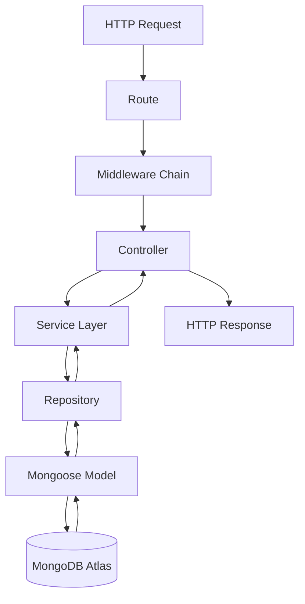
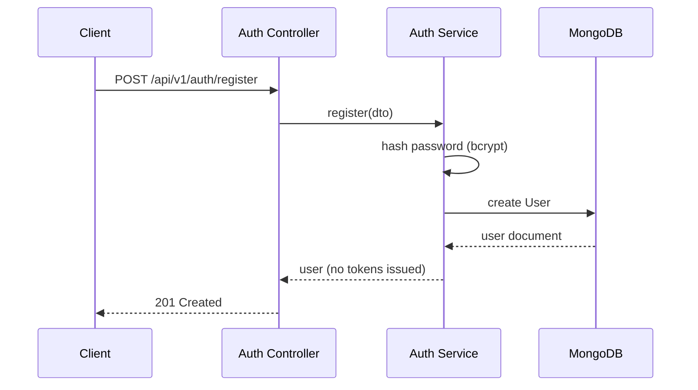
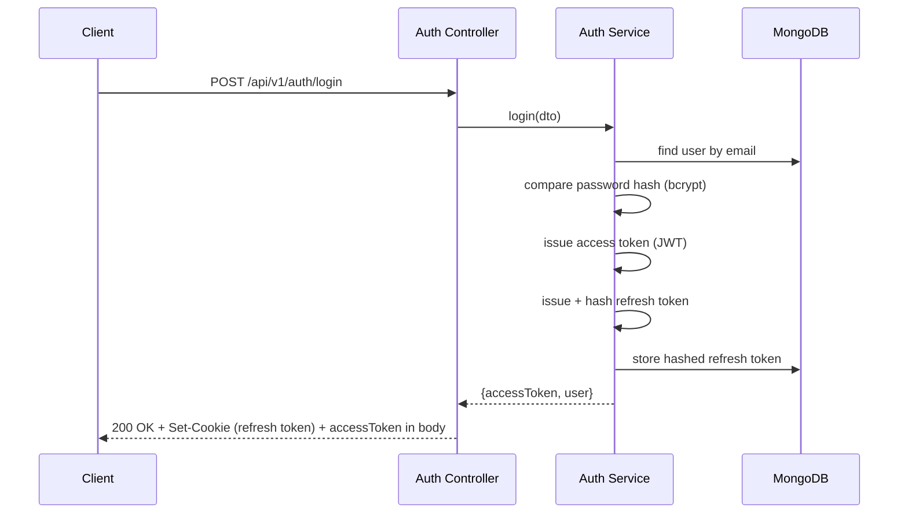
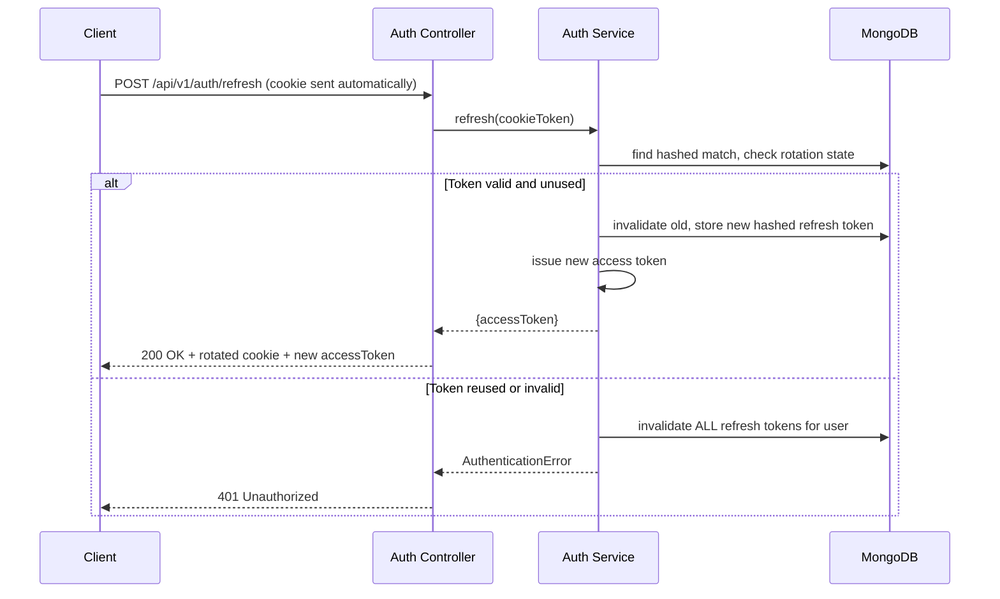

# Backend Architecture — Expense Splitter (Enhanced)

**Phase:** 1 — System Design
**Milestone:** 1.3
**Status:** Draft
**Depends on:** All Phase 0 documents, SYSTEM_ARCHITECTURE.md, FRONTEND_ARCHITECTURE.md (frozen)

> **Resolving the carried-forward open item:** the soft-removal-vs-hard-removal question (flagged since Phase 0 Milestone 0.2) is settled here as **soft removal**: a group member's active membership is deactivated (status flag + `removedAt` timestamp), never deleted, and every historical `Expense`/`Settlement` document retains its `payer`/`splitAmong` user references regardless of a member's current membership status. This is now a locked architectural decision, not an assumption — it directly implements FR-008 and the Team Collaborator persona's audit-trail requirement, and it is the design this document and `DATABASE_DESIGN.md` build on.

---

## 1. Backend Architecture Overview

The backend is the sole authority for every financial computation, every authorization decision, and every piece of persisted state (Section 1 of `FRONTEND_ARCHITECTURE.md`). Its responsibility boundary is simple to state: **anything that must be correct, trusted, or secure lives here — the frontend only renders what this layer produces.**

**Request lifecycle, at a glance:**



**Layer separation, restated precisely:**
- **Routes** — map an HTTP verb + path to a controller function; attach the specific middleware that endpoint requires.
- **Middleware** — cross-cutting concerns applied before a controller runs: authentication, authorization, validation, rate limiting.
- **Controllers** — translate an HTTP request into a service call, and a service's return value into an HTTP response. Nothing more.
- **Services** — own all business logic: split calculation, balance aggregation, settlement computation, orchestration across repositories.
- **Repositories** — the only layer that imports and queries Mongoose models directly; encapsulate persistence mechanics.
- **Models** — Mongoose schemas: field definitions, field-level validation, indexes.

No layer is skipped and no layer reaches past its immediate neighbor — a controller never imports a Mongoose model, and a service never constructs a raw Mongoose query itself.

---

## 2. Backend Architectural Principles

**Separation of concerns** — each layer in Section 1 has exactly one job; a bug in split-calculation logic is fixed in one service file, never scattered across a route handler and a model hook.

**Thin controllers** — a controller's body should be roughly: validate request shape (via middleware, not inline) → call one service method → shape the HTTP response. If a controller contains an `if` statement that encodes a business rule, that logic has leaked out of the service layer.

**Service-driven business logic** — every business rule (a split must sum to the total; only a group member may add an expense; settlement minimizes transaction count) lives in a service, independently testable without an HTTP server.

**Repository pattern** — services describe *what* data they need ("this group's expenses since date X"); repositories decide *how* to get it (a `find`, an aggregation pipeline, a future cache-backed read). This indirection is what lets persistence details change without touching business logic.

**Type safety** — TypeScript types flow from Mongoose schema definitions through repositories, into service function signatures, into controller DTOs — a change to the `Expense` schema surfaces as a compile error everywhere that shape is consumed, not a runtime `undefined`.

**Security by default** — authentication and authorization are enforced by middleware and service-layer checks respectively, on every request that needs them, by structure — not opt-in per route by convention.

**Validation at boundaries** — input is validated (Zod) the moment it crosses into the system (at the controller/middleware boundary) and never trusted again downstream; a service function can assume its input already conforms to its expected shape.

**Testability** — because business logic is isolated in services and pure utility functions (the settlement algorithm, the split calculator), the highest-risk code in the application is also the easiest to test exhaustively, with no mocking of Express internals required.

**Maintainability** — layering and folder structure (Section 3) are optimized so a new contributor (or future you) can locate "where does X happen" by convention, not by searching.

**Error consistency** — every error, regardless of where it originates, resolves to the same response shape (Section 14) via a single global error-handling middleware — no endpoint invents its own error format.

---

## 3. Backend Folder Architecture

```
server/
└── src/
    ├── config/            # env loading + validation, DB connection, third-party config
    ├── routes/            # route definitions per resource, wiring middleware to controllers
    ├── controllers/        # thin HTTP-to-service translation, one file per resource
    ├── middleware/          # auth, authorization, validation, rate limiting, error handling
    ├── services/             # business logic — the core of the application
    ├── repositories/          # Mongoose query encapsulation, one per model
    ├── models/                 # Mongoose schemas (User, Group, Expense, Settlement)
    ├── validators/               # Zod schemas for request validation
    ├── types/                     # shared TS types/interfaces (DTOs, domain types)
    ├── utils/                      # pure helper functions (currency formatting, date helpers)
    ├── errors/                      # custom error classes (Section 14)
    ├── jobs/                         # reserved, currently empty — see Section 20
    └── tests/                         # test setup/utilities shared across test files
```

**Why no `interfaces/` separate from `types/`:** TypeScript `type` and `interface` are both declared in `types/`, distinguished by filename/content, not by a parallel folder — a split here would be a distinction without a difference for this project's scale.

**Why `jobs/` exists but is empty at V1:** flagged explicitly rather than added later without a plan — no V1 operation is slow enough to justify background processing (Section 20 of `SYSTEM_ARCHITECTURE.md`), but the folder is reserved so a future recurring-expense scheduler (a V2 direction from `FEATURE_REQUIREMENTS.md`) has an obvious home without a restructure.

**Why validators are separate from types:** a Zod schema (`validators/`) and its inferred TypeScript type (`types/`, via `z.infer`) are related but serve different moments — validators run at request time, types are compile-time only — keeping them in distinct folders keeps that distinction visible.

No `dtos/`, `interfaces/`, or `constants/` top-level folders were added beyond what's listed — each would either duplicate `types/`/`validators/` or hold too little to justify a dedicated folder at this project's scope.

---

## 4. Request Lifecycle Architecture

```
HTTP Request
  ↓
Route              — matches verb + path, attaches middleware chain
  ↓
Middleware         — auth → authorization → validation (in that order, Section 7)
  ↓
Controller         — parses req into a typed DTO, calls exactly one service method
  ↓
Service            — executes business logic, calls repositories as needed
  ↓
Repository         — executes the Mongoose query/aggregation
  ↓
Database           — MongoDB Atlas
  ↓
Response           — controller shapes the service's return value into the HTTP response
```

**What controllers CAN do:**
- Extract and pass request data (body, params, query, the authenticated user from middleware) to a service.
- Call exactly one service method per action (or orchestrate a small, explicit sequence of service calls, never business logic itself, if a single HTTP action genuinely spans two services).
- Shape the service's return value into the appropriate HTTP status code and response envelope.
- Pass errors to `next()` for the global error handler — never handle business errors with inline `if`/`throw` logic that encodes a rule.

**What controllers MUST NOT do:**
- Contain any calculation (split math, balance math, settlement logic).
- Query Mongoose models directly.
- Contain authorization logic beyond calling a service/middleware check (e.g., a controller must never itself decide "is this user allowed to see this group").
- Contain validation logic beyond invoking the validation middleware — a controller should never manually check `if (!req.body.amount)`.

---

## 5. Authentication Backend Architecture

### Access Token
- **Lifetime:** short (on the order of 15 minutes) — bounds the exposure window if a token is ever leaked.
- **Storage:** never persisted server-side; it's a stateless, signed JWT verified by signature and expiry alone.
- **Verification:** authentication middleware verifies the signature and expiry on every protected request and attaches the decoded user identity to `req.user` before the controller runs.

### Refresh Token
- **Storage strategy:** issued as an httpOnly, Secure, SameSite cookie (Section 7 of `SYSTEM_ARCHITECTURE.md`); a hashed reference to the current valid refresh token is stored server-side (per user, or per session) so it can be invalidated — the raw token itself is never stored, only a hash, so a database read alone can't be used to forge a valid token.
- **Rotation:** every successful refresh issues a new refresh token and immediately invalidates the one just used — a refresh token is single-use by design.
- **Invalidation:** logout explicitly invalidates the stored (hashed) refresh token server-side, not just clearing the client cookie.
- **Reuse detection:** if a refresh token is presented that matches a token already marked used/rotated, this is treated as a signal of possible token theft (a stolen token being replayed after the legitimate client already rotated past it) — the system responds by invalidating *all* active refresh tokens for that user, forcing re-authentication everywhere, rather than silently accepting the reused token.

### Registration Flow


### Login Flow


### Refresh Flow


### Logout Flow
Client calls `POST /api/v1/auth/logout` → service invalidates the stored hashed refresh token for that session → controller clears the refresh cookie. The access token isn't server-invalidated (it's stateless by design) — it simply expires within its short lifetime, which is an accepted trade-off given that lifetime is deliberately short.

### Password Reset Flow
User requests reset → service generates a single-use, time-limited reset token (hashed before storage, mirroring refresh-token handling) → token delivered via email (email delivery mechanism itself is out of scope for this architecture document — see `FEATURE_REQUIREMENTS.md`'s "email verification architecture" note as a V1-adjacent concern) → user submits new password with the reset token → service verifies the token, updates the password hash, and invalidates the reset token and all active refresh tokens for that user (a password reset should end every existing session).

---

## 6. Authorization Architecture

**Authentication** answers "who are you" — verified once, per request, by middleware, from the access token.
**Authorization** answers "what are you allowed to access" — checked per resource, in the service layer, using the authenticated identity.

These are deliberately separate steps: authentication succeeding only proves identity, never entitlement.

**User authorization:** a user can only read or modify their own profile data; no endpoint allows one user to fetch or alter another user's account directly.

**Group membership authorization:** every group-scoped endpoint (expenses, balances, settlement, analytics within a group) requires the authenticated user to be a current, active member of that group — enforced in the service layer as an explicit membership check before any group data is read or written, not inferred from the request alone. An expense within a group is never reachable by a user who isn't (or was never) a member of that group.

**Expense ownership rules:** any active group member may create an expense within the group (consistent with `FEATURE_REQUIREMENTS.md`'s FR-011/012, which don't restrict editing to the original creator — groups are collaborative, not creator-owned). Editing or deleting an expense requires active membership in the expense's group, same as creation; V1 does not implement a stricter "only the payer can edit" rule, since none of the three personas' problem statements call for it.

**Admin/moderator possibility (future expansion):** V1 has no admin or moderator role — every group member has equal standing within their group's data, consistent with the peer-to-peer nature of all three personas. A role field is **not** added to the `User` or membership model preemptively; if a future version needs group-owner-only actions (e.g., only the creator can delete a group entirely), that's a scoped addition to the membership schema at that time, not a speculative field carried now.

---

## 7. Middleware Architecture

**Execution order** (applied by the route layer, outermost to innermost):

```
1. Security headers (Helmet)
2. CORS
3. Request logging (Morgan)
4. Rate limiting (auth endpoints specifically; a lighter global limit elsewhere)
5. Body parsing (JSON) + cookie parsing
6. Authentication middleware        — verifies access token, attaches req.user
7. Authorization middleware/checks  — resource-specific, applied per route as needed
8. Validation middleware (Zod)      — validates request body/params/query shape
9. Controller
10. Error-handling middleware       — catches anything passed to next(err), applied last
```

**Why this order:** security headers and CORS apply universally and cheaply, so they run first, before any parsing work. Rate limiting on auth endpoints runs before body parsing, so a flood of malformed requests is rejected before the server does parsing work on them. Authentication runs before authorization (you must know *who* before checking *what they can access*), and both run before validation — there's no reason to validate the shape of a request from an unauthenticated or unauthorized caller. The error handler is registered last, per Express convention, so it can catch errors from every preceding layer.

---

## 8. Database Access Architecture

**Enforced flow:** `Service → Repository → Mongoose Model` — a service never imports a Mongoose model directly; a repository is the only layer permitted to.

**Why services should not directly query MongoDB:**
- **Testability** — a service that depends on a repository interface can be unit-tested against a mocked/in-memory repository, with no real database connection required; a service with inline Mongoose calls can't be tested without one.
- **Database abstraction** — if a query needs to change from a simple `find` to an aggregation pipeline for performance (Section 20), that change is confined to the repository; every service calling it is unaffected.
- **Maintainability** — all MongoDB-specific syntax and query patterns live in one place per model, so a developer debugging a query performance issue knows exactly where to look, and query logic isn't duplicated across multiple services that happen to need similar data.

Each model has exactly one corresponding repository (`userRepository`, `groupRepository`, `expenseRepository`, `settlementRepository`), exposing intention-revealing methods (`findActiveMembersByGroup`, `findExpensesByGroupSince`) rather than leaking raw query-builder objects back to services.

---

## 9. Expense Domain Backend Architecture

**Entities and relationships:**
- **User** — an account; independent of any group.
- **Group** — has a `members` list, where each entry references a `User` and carries a membership status (`active` | `removed`) and timestamps — this is the soft-removal model locked in above.
- **Expense** — belongs to one `Group`; references one `User` as `payer`; references a `splitAmong` list of `User`s with their computed per-member share (in integer cents, Section 10); carries `description`, `category`, `date`. Payer and split-member references are retained permanently, independent of the referenced user's current membership status in the group.
- **Settlement** — represents a recorded, completed payment between two `User`s within a `Group` (created when a suggested payment, computed dynamically per Section 12, is marked as paid) — not a cache of the settlement suggestion itself.

**Expense creation flow:**
```
Controller receives validated CreateExpenseDTO
  → Service: verify authenticated user is an active member of the target group
  → Service: verify payer and all splitAmong members are (or were) valid group members
  → Split Calculation Engine (Section 10): compute per-member shares from splitMethod + input
  → Repository: persist Expense document
  → Balance Calculation Service (Section 11) invalidated/recomputed for the group
  → Response: created Expense + updated balances
```

**Expense update flow:** same validation and authorization path as creation; the split is fully recalculated from the edited input (never patched incrementally) to avoid any drift between a partially-updated split and its stored total. Balances are recomputed after the update, identically to creation.

**Expense deletion flow:** authorization check (active group membership) → repository delete → balance recomputation for the group, reflecting the expense's removal. Deletion is a hard delete of the `Expense` document itself (distinct from the soft-removal of *members* discussed above) — an incorrectly-entered expense should be fully removable, since `FEATURE_REQUIREMENTS.md` FR-012 specifies deletion as a first-class capability, and expenses (unlike membership) don't carry the same audit-trail requirement once removed by an authorized member.

---

## 10. Split Calculation Engine Architecture

**File:** `services/expenseCalculation.service.ts`

**Core rule — integer cents only:** every monetary value entering this engine is an integer number of cents (matching the frontend's contract from `FRONTEND_ARCHITECTURE.md` Section 10). Floating-point arithmetic is never used for money at any point in this service — this is the single most important correctness rule in the entire backend.

**Input format:**
```typescript
type SplitInput =
  | { method: 'equal'; totalCents: number; participantIds: string[] }
  | { method: 'unequal'; totalCents: number; shares: { userId: string; amountCents: number }[] }
  | { method: 'percentage'; totalCents: number; shares: { userId: string; percentage: number }[] } // percentage as integer basis points (e.g., 5000 = 50.00%)
```

**Validation rules (rejected before any calculation runs):**
- `totalCents` must be a positive integer.
- **Equal:** `participantIds` must have at least one entry and contain no duplicates.
- **Unequal:** every `amountCents` must be a non-negative integer; the sum of all `amountCents` must equal `totalCents` exactly.
- **Percentage:** every `percentage` (in basis points) must be a non-negative integer; the sum of all `percentage` values must equal exactly `10000` (100.00%).

**Calculation process:**
- **Equal split:** `totalCents` divided by `participantIds.length`, using integer division (`Math.floor`) — this produces a per-member base amount and a remainder (`totalCents % participantIds.length`). The remainder (always fewer cents than there are participants) is distributed one cent at a time to the first N participants (by a deterministic order, e.g., array order) so the sum of all shares always equals `totalCents` exactly — never `totalCents ± remainder` unaccounted for.
- **Unequal split:** shares are used directly as provided, having already been validated to sum to `totalCents` — no calculation beyond validation is required.
- **Percentage split:** each member's share is `Math.floor(totalCents * percentage / 10000)`, producing the same remainder-distribution problem as equal split — the leftover cents (`totalCents` minus the sum of floored shares) are distributed one cent at a time, in a deterministic order (e.g., largest fractional remainder first — the "largest remainder method" — for fairness), until the full amount is allocated.

**Output format:**
```typescript
type SplitResult = {
  totalCents: number;
  shares: { userId: string; amountCents: number }[]; // sum of amountCents === totalCents, always
};
```

**Rounding handling and precision rules:** the "largest remainder method" described above is the standard, well-understood approach to distributing an indivisible remainder fairly across shares — it guarantees the output always sums exactly to the input total (no expense can ever be "off by a cent" in aggregate), and it's a pure, fully deterministic function of its input, making it exhaustively unit-testable (e.g., $100.00 split three ways must always produce `[3334, 3333, 3333]` or an equivalent deterministic distribution, never three equal `3333` shares that sum to `9999`).

**Validation failures:** any rule violation above throws a `ValidationError` (Section 14) with a specific `errorCode` (e.g., `SPLIT_SUM_MISMATCH`, `INVALID_PERCENTAGE_TOTAL`) before any persistence occurs — an invalid split is never partially saved.

---

## 11. Balance Calculation Architecture

**File:** `services/balanceCalculation.service.ts`

**How balances are calculated:** for a given group, for each member, sum every expense's split share where that member appears in `splitAmong` (their cost), and sum every expense where that member is the `payer` (their contribution) — the member's net balance is `totalPaid - totalOwed`, in integer cents.

**Example:**
```
User A paid:        5000 cents (across expenses where A is payer)
User A's own share:  3000 cents (A's portion of splits they're part of)
Net balance:        +2000 cents  →  User A is owed 2000 cents by the group
```

- **Positive balance** — the member has paid more than their share; the group owes them.
- **Negative balance** — the member owes more than they've paid; they owe the group.
- **Zero balance** — the member is exactly even.

Balances are always computed per-group (never globally across a user's multiple groups) and always as a **live aggregation over current expense data** — never a persisted, incrementally-updated running total — which guarantees the balance can never drift from what the underlying expenses actually imply (Section 4 of `FEATURE_REQUIREMENTS.md`'s Reliability non-functional requirement).

**Performance considerations:** this is implemented as a single MongoDB aggregation pipeline per group (grouping and summing across the group's `Expense` collection), not an application-level loop over individually-fetched documents — avoiding the N+1 pattern flagged in Section 20. Given realistic group/expense volumes (Section 9 of `SYSTEM_ARCHITECTURE.md`), this aggregation is expected to complete well within an interactive response time; if usage ever grew enough to challenge that, a cached/incrementally-maintained balance (recalculated on write rather than on read) would be the natural next step — deliberately not built now (see Section 9, `SYSTEM_ARCHITECTURE.md`, on avoiding premature caching).

---

## 12. Settlement Algorithm Architecture

**File:** `utils/settleUpAlgorithm.ts`

**Input:** the group's current net balances (from Section 11) — an array of `{ userId, balanceCents }`, where positive means owed and negative means owing.

**Process (greedy debtor/creditor matching):**
1. Partition members into creditors (`balanceCents > 0`) and debtors (`balanceCents < 0`).
2. Sort creditors descending by amount owed to them; sort debtors descending by amount they owe.
3. Repeatedly take the largest creditor and largest debtor; settle the smaller of the two magnitudes between them (a transaction from debtor to creditor for that amount); reduce both balances by that amount.
4. Any balance that reaches zero is removed from further consideration; repeat until no balances remain.

**Output:** an ordered list of `{ from: userId, to: userId, amountCents: number }` — the minimal-count set of payments that zeroes every balance.

**Example:**
```
Balances: A: +5000, B: -3000, C: -2000
Step 1: largest creditor A (+5000), largest debtor B (-3000) → B pays A 3000. A: +2000, B: 0.
Step 2: largest creditor A (+2000), largest debtor C (-2000) → C pays A 2000. A: 0, C: 0.
Result: [ {from: B, to: A, amount: 3000}, {from: C, to: A, amount: 2000} ]
```

**Complexity analysis:** sorting is O(n log n); the matching loop runs at most n−1 times, since each iteration fully zeroes out at least one member's balance — overall **O(n log n) time**, **O(n) space** for n group members with non-zero balances.

**Why settlement is calculated dynamically instead of stored:** a stored settlement suggestion would need to be invalidated and recomputed every time any expense in the group changes — effectively requiring the same computation anyway, plus the added complexity of cache invalidation logic and the risk of a stale suggestion being shown if invalidation is ever missed. Computing it fresh on each request, from the always-current balances (Section 11), guarantees the suggestion is never wrong relative to the latest data, at a computational cost (O(n log n) over a small n) that's negligible at this product's realistic scale.

---

## 13. Validation Architecture

**Layers:**
- **Request validation** (Zod, at the middleware boundary) — is the request shape well-formed? Correct types, required fields present, string lengths reasonable. This layer knows nothing about business rules.
- **Business validation** (in services) — does this request make sense given the current state of the system? A split summing to the total is a business rule (depends on the expense's `totalCents`, not just the shape of the split array); "is this user a member of this group" is a business rule.
- **Database validation** (Mongoose schema-level) — the last line of defense: field types, required fields, enum constraints enforced at the persistence layer, catching anything that somehow bypassed the layers above (defense in depth, not the primary validation mechanism).

**Examples:**
- **Invalid expense amount** (e.g., negative or zero `totalCents`) — caught at request validation (Zod schema constrains `totalCents` to a positive integer) before it reaches the service.
- **Invalid split percentage** (percentages not summing to 100%) — caught at business validation, inside `expenseCalculation.service.ts` (Section 10), since it requires evaluating the full set of shares together, not just one field's shape.
- **Unauthorized group access** — caught at the authorization layer (Section 6), not validation at all — this is a distinct failure category (the request is well-formed and business-rule-valid, but the requester isn't allowed to make it).

---

## 14. Error Handling Architecture

**Custom error classes** (extending a common `AppError` base with `statusCode` and `errorCode`):
```typescript
class AppError extends Error {
  constructor(public message: string, public statusCode: number, public errorCode: string, public details?: unknown) { super(message); }
}
class ValidationError extends AppError { /* 400 */ }
class AuthenticationError extends AppError { /* 401 */ }
class AuthorizationError extends AppError { /* 403 */ }
class NotFoundError extends AppError { /* 404 */ }
```

Services and repositories throw these specific error types (never a bare `Error` or an inline `res.status().json()`), so the origin of a failure is encoded in its type, not inferred from a message string.

**Global error middleware:** registered last in the middleware chain (Section 7); catches every error passed to `next(err)`. If the error is an instance of `AppError`, its `statusCode`/`errorCode`/`message` are used directly; any unrecognized error (a genuine bug/unexpected exception) is logged with full detail (Winston, Section 18) and returned to the client as a generic 500 with no internal detail leaked.

**Standard API error response format:**
```json
{
  "success": false,
  "message": "The split amounts do not sum to the expense total.",
  "errorCode": "SPLIT_SUM_MISMATCH",
  "details": { "expected": 10000, "received": 9950 }
}
```

Every endpoint, regardless of what failed or where, returns this exact shape — the frontend's error-normalization layer (Section 6 of `FRONTEND_ARCHITECTURE.md`) depends on this consistency.

---

## 15. Database Model Architecture

*(Architecture-level responsibilities only — full schemas belong to `DATABASE_DESIGN.md`.)*

**User model:** owns identity (email, hashed password, name, avatar) and hashed-refresh-token state for auth (Section 5). Indexed uniquely on `email` (every login queries by it).

**Group model:** owns a `members` array, where each entry is `{ user: ObjectId, status: 'active' | 'removed', joinedAt, removedAt? }` — this is the concrete implementation of the locked soft-removal decision. Indexed on `members.user` to support "which groups is this user in" queries efficiently.

**Expense model:** references `group`, `payer`, and a `splitAmong` array of `{ user: ObjectId, amountCents: number }` (the computed output of Section 10). Indexed on `group` (every expense query is group-scoped — the highest-value index in the schema, per `SYSTEM_ARCHITECTURE.md` Section 9) and on `group + date` for the analytics trend queries (Section 20).

**Settlement model:** references `group`, `from`, `to`, `amountCents`, `status` (e.g., `completed`), `date` — created only when a settlement suggestion is acted upon (Section 12), not proactively for every computed suggestion.

**Relationships:** all four models relate through ObjectId references (not embedding), since expenses and settlements need to be queried, filtered, and aggregated independently of their parent group/user documents — embedding would make the balance-aggregation pipeline (Section 11) unnecessarily complex.

**Soft deletion strategy:** applies specifically to **group membership** (locked decision above) — it does not apply to `Expense` documents (hard-deleted per Section 9) or to `User` accounts (account deletion is out of `FEATURE_REQUIREMENTS.md`'s V1 scope entirely, so no strategy is needed yet). This asymmetry is intentional: membership needs to preserve historical attribution; a mistakenly-entered expense does not need the same protection.

---

## 16. Security Architecture

- **Password hashing** — bcrypt, with a cost factor appropriate for current hardware (reviewed periodically, not fixed permanently); plaintext passwords never logged, never stored, never included in any response.
- **JWT security** — access tokens signed with a strong secret (environment-provided, Section 21), short expiry (Section 5), and no sensitive data (password hash, refresh token) embedded in the payload — only the minimal claims needed (user id, issued-at, expiry).
- **Refresh token security** — httpOnly/Secure/SameSite cookie, hashed at rest, rotated on every use, reuse-detected (Section 5).
- **Helmet** — applied globally as the first middleware (Section 7), setting secure headers by default.
- **CORS** — restricted to the deployed frontend's exact origin in production; not wildcarded.
- **Rate limiting** — applied specifically and more aggressively to authentication endpoints (login, register, password reset) to blunt brute-force/credential-stuffing.
- **Input validation** — Zod at every mutating endpoint (Section 13), rejecting malformed input before it reaches business logic.
- **No sensitive data leakage** — API responses never include password hashes or raw refresh tokens; error responses in production never include stack traces (Section 14).
- **Environment variables** — all secrets (JWT signing key, DB connection string, CORS origin) loaded from environment variables, validated at startup (via a Zod-validated config schema in `config/`) so a missing required variable fails fast at boot rather than causing a confusing runtime error later.
- **MongoDB security** — Atlas access restricted by IP allowlist, application connects with a database user scoped to only the permissions it needs (not an admin credential), consistent with `SYSTEM_ARCHITECTURE.md` Section 6.

---

## 17. API Architecture

**Base path and versioning:** `/api/v1/...` — the version prefix is included from the start so a future breaking change (`/api/v2/`) can be introduced without disrupting existing clients; V1 itself is not expected to need a v2 during this project's scope, but the convention costs nothing to adopt now.

**Resource organization:**
```
/api/v1/auth          — register, login, logout, refresh, password reset
/api/v1/users         — current user profile (self only, per Section 6)
/api/v1/groups        — group CRUD, membership management
/api/v1/groups/:id/expenses      — expense CRUD, scoped to a group
/api/v1/groups/:id/balances      — current balances for a group
/api/v1/groups/:id/settlement    — settlement suggestions for a group
/api/v1/groups/:id/analytics     — analytics endpoints for a group
```

**Controller mapping:** each top-level resource maps to one controller file (`authController`, `groupController`, `expenseController`, etc.) — nested/group-scoped resources (expenses, balances, settlement, analytics) are still separate controllers, not methods bolted onto `groupController`, keeping each controller focused on one resource's HTTP surface.

**Response format:** every successful response follows a consistent envelope —
```json
{ "success": true, "data": { /* resource-specific payload */ } }
```
mirroring the error envelope's `success` field (Section 14), so the frontend's response handling can branch on one consistent field regardless of outcome.

---

## 18. Logging Architecture

**Winston** (structured application logging):
- **Development** — verbose, human-readable console output including debug-level logs (service entry/exit for complex operations, e.g., settlement computation input/output during development).
- **Production** — structured JSON output (suitable for ingestion by a hosting platform's log aggregation), warn-level and above by default, with error-level logs always including full stack traces and relevant context (user id, request id) — but never sensitive data (passwords, tokens).
- **Error logging** — every error reaching the global error middleware (Section 14) is logged via Winston before the response is sent, regardless of whether it's an expected `AppError` or an unexpected exception — expected errors at `warn` level, unexpected ones at `error` level.
- **Security events** — authentication failures, refresh-token reuse detection (Section 5), and repeated rate-limit triggers are logged explicitly at `warn`/`error` level, distinct from ordinary request logs, so they're identifiable in log review without parsing every request line.

**Morgan** (HTTP request logging): concise request-line logging (method, path, status, response time) in development for immediate feedback during local work; reduced or routed through Winston's structured output in production to avoid unbounded, unstructured log growth (Section 8 of `SYSTEM_ARCHITECTURE.md`).

---

## 19. Testing Architecture

**Unit testing** (highest priority, given financial correctness):
- `expenseCalculation.service.ts` — every split method, exhaustively, including remainder-distribution edge cases (non-evenly-divisible totals, single-participant splits, many-participant splits).
- `settleUpAlgorithm.ts` — correctness (output always sums to zero net movement, minimality of transaction count) across varied balance distributions, including edge cases (all-zero balances, a single creditor/debtor pair).
- `balanceCalculation.service.ts` — correctness against known expense/split fixtures.
- Utility functions (currency formatting, remainder-distribution helper).

**Integration testing:**
- API endpoints tested against a real (test-database) MongoDB instance — expense creation through to balance reflection, authorization rejection for non-members, auth flow (register → login → protected request → refresh → logout).

**E2E testing:** the core user journey (register → create group → add expense → view balance → view settlement) as a small number of high-value scripted flows — mirroring the frontend's E2E scope (Section 15 of `FRONTEND_ARCHITECTURE.md`) so both layers protect the same critical path without redundant, exhaustive overlap.

**Tooling:** Vitest for unit/integration tests (Vitest is confirmed for both frontend and backend per this milestone's stated context — consistent tooling across the monorepo reduces configuration duplication and contributor context-switching cost).

**Priority tests, explicitly called out:** split calculation correctness, settlement algorithm correctness, authorization protection (a non-member must never reach group data, tested explicitly per endpoint), and the full authentication lifecycle (including refresh rotation and reuse detection) — these four are the non-negotiable test surface; broader coverage is valuable but secondary.

---

## 20. Performance Architecture

- **Database indexes** — `User.email` (unique), `Group.members.user`, `Expense.group`, `Expense.group + date` (Section 15) — chosen specifically to match the query patterns every core-loop action actually performs, not indexed speculatively.
- **Query optimization** — balance calculation (Section 11) and analytics aggregation (category/monthly/contribution) use MongoDB aggregation pipelines to compute sums server-side in the database, rather than fetching all expense documents and summing in application code.
- **Aggregation strategy** — a single aggregation pipeline per balance/analytics request, grouped by the relevant dimension (member, category, month) — avoiding multiple round-trips for what's conceptually one query.
- **Avoiding N+1 queries** — fetching a group's expenses never triggers a per-expense follow-up query for payer/member details; population (Mongoose `.populate()`) or a single aggregation `$lookup` is used instead of looping and querying per document.
- **Pagination strategy** — expense history endpoints support cursor- or offset-based pagination (page size capped, e.g., 50 per page) rather than returning an unbounded list — relevant specifically for the Roommate persona's long-lived, ever-growing expense history.
- **Large expense history handling** — analytics queries (monthly trend, category breakdown) are computed via aggregation over the full history rather than requiring the client to paginate through raw expenses and sum client-side, keeping large-history performance a database-side concern, not a frontend one.

---

## 21. Deployment Architecture

- **Backend deployment:** containerized deployment to a Railway/Render-style platform — a single Node.js process serving the Express app, consistent with the monolithic decision (ADR-001).
- **Environment variables:** JWT signing secret, MongoDB Atlas connection string, CORS allowed origin, and any other secrets injected via the hosting platform's environment configuration — validated at startup (Section 16) — never committed to source control.
- **Production configuration:** `NODE_ENV=production` gates verbose logging (Section 18), stack-trace exposure (Section 14), and CORS wildcarding off by default — these are environment-driven, not manually toggled per deploy.
- **Database connection:** MongoDB Atlas, connection pooling handled by the Mongoose driver's defaults (appropriate at this scale — no custom pool tuning needed for V1's realistic load).
- **Logging in production:** Winston's production transport (Section 18) writes structured logs consumable by the hosting platform's log viewer — no separate log-aggregation service introduced at V1 scope.

---

## 22. Architectural Decision Records

### ADR-001 — Monolithic Backend Architecture
**Decision:** Single Express application, not split into services.
**Reason:** Matches `SYSTEM_ARCHITECTURE.md` ADR-001 — solo-developer, portfolio-scoped project where a monolith is faster to build, reason about, and deploy.
**Alternative considered:** Microservices (separate auth/expense/settlement services).
**Trade-off:** A monolith couples deployment of unrelated features together (deploying an analytics fix redeploys the whole app) — accepted, since at this scale that coupling has no real operational cost, while microservices would add distributed-system complexity (service discovery, network calls between services, distributed consistency for balance calculation) with no corresponding benefit.

### ADR-002 — Service Layer Pattern
**Decision:** All business logic isolated in a service layer, never in controllers.
**Reason:** Testability (services are unit-testable without HTTP scaffolding) and reuse (create/update expense flows share the same split-calculation and balance-recalculation logic).
**Alternative considered:** Fat-controller MVC (logic directly in route handlers).
**Trade-off:** An additional layer of indirection to trace through — accepted, since the alternative makes `expenseCalculation.service.ts`-equivalent logic untestable in isolation, unacceptable given financial correctness is this project's highest priority.

### ADR-003 — Repository Pattern
**Decision:** A dedicated repository layer between services and Mongoose models.
**Reason:** Isolates persistence mechanics from business logic (Section 8) — services stay focused on rules, not query syntax.
**Alternative considered:** Services querying Mongoose models directly.
**Trade-off:** More files and an extra indirection for what's sometimes a simple `findById` — accepted, because the abstraction pays for itself specifically in the balance/analytics aggregation queries (Section 20), where query complexity is real and isolating it matters.

### ADR-004 — JWT Access + Refresh Token Architecture (with Rotation)
**Decision:** Short-lived stateless access tokens; longer-lived, rotated, reuse-detected refresh tokens in httpOnly cookies.
**Reason:** Matches `SYSTEM_ARCHITECTURE.md` ADR-003 — balances a small stolen-token exposure window against not forcing frequent re-logins, with rotation/reuse-detection providing a real theft-detection mechanism.
**Alternative considered:** Traditional server-side sessions.
**Trade-off:** Requires a server-side hashed-token store for refresh tokens (not fully stateless) — accepted, since it's a small, well-indexed lookup, and it's the only way to support explicit logout invalidation and reuse detection, both required by Section 5.

### ADR-005 — MongoDB Decision
**Decision:** MongoDB via Mongoose as the sole datastore.
**Reason:** Matches `SYSTEM_ARCHITECTURE.md` ADR-004 — document-shaped fit for group/expense data, flexible enough for split-type variation without a rigid relational schema.
**Alternative considered:** PostgreSQL.
**Trade-off:** Relational integrity (e.g., a `payer` reference pointing to a real user) is enforced at the application layer, not the database layer — accepted, and specifically compensated for by explicit business validation (Section 13) checking reference validity before persistence, rather than relying on foreign-key constraints.

### ADR-006 — Integer Cents Financial Calculation Strategy
**Decision:** All monetary values are represented and calculated as integer cents, end-to-end, from the database through the API to the frontend (matching `FRONTEND_ARCHITECTURE.md` Section 10's contract).
**Reason:** Floating-point arithmetic cannot represent many decimal currency values exactly, and repeated float operations (splitting, summing across many expenses) compound rounding error — unacceptable for a product whose core promise is financially correct balances.
**Alternative considered:** Storing/calculating amounts as floating-point decimals (e.g., JavaScript `number` representing dollars).
**Trade-off:** Requires disciplined conversion at the UI display boundary (cents → formatted dollar string) on both frontend and backend — accepted as a small, one-time discipline cost against the alternative's risk of silent, hard-to-reproduce cent-level discrepancies in exactly the calculations this product exists to get right.

### ADR-007 — Settlement Algorithm Design (Greedy, Computed Dynamically)
**Decision:** A greedy debtor/creditor-matching algorithm, computed fresh from current balances on each request, not persisted as a cached suggestion.
**Reason:** Greedy matching provably minimizes transaction count for this problem structure at O(n log n) time; dynamic computation guarantees the suggestion is always consistent with the latest expense data (Section 12).
**Alternative considered:** An exact minimum-cost-flow formulation (guaranteed globally optimal under more complex objective functions), and/or persisting settlement suggestions with manual invalidation.
**Trade-off:** The greedy approach minimizes transaction *count* but doesn't optimize for other possible objectives (e.g., preferring payments between members who already have a relationship) — accepted, since transaction-count minimization is the actual, stated product differentiator (`PROBLEM_STATEMENT.md` Section 1) and a more complex optimization would add algorithmic complexity with no corresponding user-facing benefit for this product's scope.

---

## 23. Production Readiness Review

**Backend Architecture Score: 9/10** — the document is implementation-ready: every layer's responsibility is explicit, the financial-correctness strategy (integer cents, largest-remainder rounding, dynamic settlement) is rigorous rather than hand-waved, and the soft-removal decision that was blocking schema work is now locked in and reflected consistently through Sections 9, 15, and the ADRs.

**Approval status: APPROVED**

**Critical issues:** none identified — no gap here would require reversing a decision already made in `SYSTEM_ARCHITECTURE.md` or `FRONTEND_ARCHITECTURE.md`, and the integer-cents contract (this document's most safety-critical decision) is now confirmed consistent across both frontend and backend documents.

**Recommended improvements (non-blocking, worth carrying into `DATABASE_DESIGN.md`):**
- Define the exact TTL/expiry handling for password-reset tokens (mentioned in Section 5 but not given a specific lifetime here — belongs as a concrete value in implementation, not necessarily this document).
- Confirm the exact bcrypt cost factor as a reviewed constant (not a blocking decision, but worth a stated default before implementation).
- `DATABASE_DESIGN.md` should make explicit exactly how the `largest remainder method`'s deterministic tie-breaking order is defined (e.g., array order vs. a stable sort by user id) — this document establishes the method but the precise tie-break rule is schema/implementation-adjacent detail appropriately deferred.

**Missing production concerns (explicitly and reasonably deferred, not oversights):** background job processing, caching layer, and horizontal-scaling configuration are all intentionally absent, consistent with Section 9 of `SYSTEM_ARCHITECTURE.md` — flagged here again so the deferral reads as a decision, not a gap, at review time.
