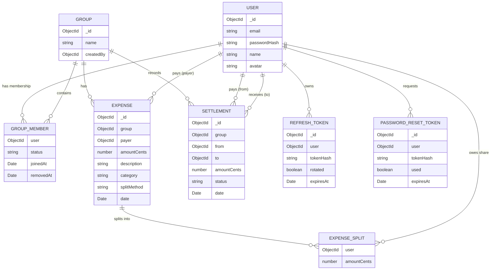

# Database Design — Expense Splitter (Enhanced)

**Phase:** 1 — System Design
**Milestone:** 1.4
**Status:** Draft
**Depends on:** All Phase 0 documents, SYSTEM_ARCHITECTURE.md, FRONTEND_ARCHITECTURE.md, BACKEND_ARCHITECTURE.md (frozen)

---

## 1. Database Architecture Overview

**Why MongoDB fits this product:** the core domain entities — a group with a variable-shaped membership list, an expense with a split whose structure differs by method (equal/unequal/percentage) — are naturally document-shaped rather than uniformly tabular. An `Expense` document's `splitAmong` array is a small, cohesive, always-read-together structure; modeling it as a separate relational table with its own foreign keys would add join overhead for data that's always consumed as a unit. MongoDB's schema flexibility also accommodates the three split methods without a rigid, heavily-nullable relational column set (per `BACKEND_ARCHITECTURE.md` ADR-005).

**Database responsibilities:** persistence and schema-level validation (the last line of defense per `BACKEND_ARCHITECTURE.md` Section 13) — never business logic, never authorization decisions. Every business rule (split correctness, membership authorization) is enforced above this layer, in services; the database's job is to store what it's given correctly and efficiently, and to reject data that violates its structural constraints (types, required fields, enums).

**Data ownership boundaries:** each collection is owned by exactly one repository (`BACKEND_ARCHITECTURE.md` Section 8) — no two repositories write to the same collection, and no collection is queried outside its owning repository. This document defines the collections; the repository layer already defined in `BACKEND_ARCHITECTURE.md` is the only access path to them.

---

## 2. Database Design Principles

**Schema consistency** — every collection follows the same conventions: `_id` as the primary key (MongoDB default ObjectId), `createdAt`/`updatedAt` timestamps on every collection (via Mongoose's built-in timestamp option), and consistent naming (`camelCase` fields, plural collection names).

**Data integrity** — enforced in layers (per `BACKEND_ARCHITECTURE.md` Section 13): Mongoose schema validation as the structural floor, service-layer business validation as the actual authority, Zod at the API boundary as the first filter. No single layer is trusted alone — this is defense in depth, not redundancy for its own sake.

**Index-first thinking** — every index in this document exists because a specific, named query pattern (Section 17) requires it — never spec ulative "might need it later" indexes, consistent with `BACKEND_ARCHITECTURE.md` Section 20's stated approach.

**Reference strategy** — ObjectId references between collections, not embedding, wherever the referenced data needs independent querying, filtering, or aggregation (Section 12 elaborates).

**Historical data preservation** — expense and settlement records, once created, retain their user references permanently regardless of a member's later removal from the group (the soft-removal decision locked in `BACKEND_ARCHITECTURE.md`). A group's financial history is an append-only record from the perspective of membership changes.

**Financial precision rules** — every monetary field in every collection is an integer number of cents (`BACKEND_ARCHITECTURE.md` ADR-006); this document never introduces a `Number`/float monetary field anywhere, without exception.

---

## 3. Entity Relationship Overview



**Note on `GROUP_MEMBER` and `EXPENSE_SPLIT`:** neither is a standalone MongoDB collection — both are embedded subdocument arrays (`Group.members`, `Expense.splitAmong` respectively), shown here as separate ER entities purely to make their fields and relationships explicit. This is clarified fully in Section 4.

---

## 4. Collection Architecture

**`users`**
- **Purpose:** account identity and authentication state.
- **Ownership:** `userRepository`.
- **Relationships:** referenced by `groups.members.user`, `expenses.payer`, `expenses.splitAmong.user`, `settlements.from`/`to`, `refreshTokens.user`, `passwordResetTokens.user`.
- **Lifecycle:** created at registration; updated on profile edits; no delete path in V1 (account deletion is out of scope per `FEATURE_REQUIREMENTS.md`).

**`groups`**
- **Purpose:** the shared context that scopes all expense and settlement activity; owns the membership list (embedded, per soft-removal architecture).
- **Ownership:** `groupRepository`.
- **Relationships:** referenced by `expenses.group`, `settlements.group`; embeds member subdocuments referencing `users`.
- **Lifecycle:** created by an authenticated user; members added/soft-removed over time; group deletion is not a V1 capability (not specified in `FEATURE_REQUIREMENTS.md` — a group persists as long as any of its data does).

**`expenses`**
- **Purpose:** the system's core record — what was spent, by whom, and how it's split.
- **Ownership:** `expenseRepository`.
- **Relationships:** references `groups` (`group`), `users` (`payer`, and each `splitAmong.user`).
- **Lifecycle:** created, editable (full split recalculation on edit, per `BACKEND_ARCHITECTURE.md` Section 9), hard-deletable by any active group member.

**`settlements`**
- **Purpose:** a historical record of completed payments — created only when a dynamically-computed settlement suggestion (`BACKEND_ARCHITECTURE.md` Section 12) is acted upon, not a cache of every suggestion ever shown.
- **Ownership:** `settlementRepository`.
- **Relationships:** references `groups` (`group`), `users` (`from`, `to`).
- **Lifecycle:** created when a user marks a suggested payment as completed; immutable once created (a settlement record is a receipt, not an editable object — a mistaken settlement is handled by recording a correcting expense, not by mutating history).

**`refreshTokens`**
- **Purpose:** server-side record enabling refresh-token invalidation, rotation tracking, and reuse detection (`BACKEND_ARCHITECTURE.md` Section 5).
- **Ownership:** `authRepository` (a dedicated repository for auth-token collections, distinct from `userRepository`, since these are operationally different from profile data).
- **Relationships:** references `users` (`user`).
- **Lifecycle:** created on login; superseded (marked rotated) on each refresh; deleted or marked invalid on logout, reuse detection, or natural expiry.

**`passwordResetTokens`**
- **Purpose:** single-use, time-limited tokens authorizing a password reset.
- **Ownership:** `authRepository`.
- **Relationships:** references `users` (`user`).
- **Lifecycle:** created on reset request; marked `used` on successful reset (never reusable); expires automatically after its time window.

---

## 5. Mongoose Schema Design — Conventions

Every schema below follows the same conventions, stated once here rather than repeated per collection: `_id` is the default MongoDB ObjectId; `{ timestamps: true }` is enabled on every schema, providing `createdAt`/`updatedAt` automatically; all ObjectId reference fields declare their `ref` target explicitly for Mongoose population support; required fields are marked `required: true` at the schema level as the structural floor described in Section 2.

---

## 6. User Schema

```typescript
interface IUser {
  email: string;              // required, unique, lowercase, indexed
  passwordHash: string;       // required, never returned in API responses
  name: string;                // required
  avatar?: string;             // optional, URL
  createdAt: Date;
  updatedAt: Date;
}
```

**Authentication fields:** `email` (unique index — every login queries by it), `passwordHash` (bcrypt output, never plaintext, excluded from `toJSON`/API serialization by schema-level transform).

**Profile fields:** `name`, `avatar` (optional) — per `FEATURE_REQUIREMENTS.md`'s User Profile feature (P1).

**Refresh token relation strategy:** refresh tokens are **not** embedded in the `User` document — they live in the separate `refreshTokens` collection (Section 10), referencing `user`. This is deliberate: a user may hold multiple concurrent sessions (multiple devices), and embedding a growing, frequently-mutated token array inside the user document would make every login/refresh operation rewrite an unrelated part of the user's profile data, and would make reuse-detection queries (which need to find a specific token, not a specific user) awkward.

**Security considerations:** `passwordHash` is explicitly excluded from any `.toJSON()`/`.toObject()` output via a schema transform, so it can never accidentally leak into an API response even if a future endpoint forgets to manually strip it — a structural safeguard, not just a coding discipline.

---

## 7. Group Schema

```typescript
interface IGroupMember {
  user: ObjectId;              // ref: 'User', required
  status: 'active' | 'removed'; // required, default 'active'
  joinedAt: Date;                // required, default now
  removedAt?: Date;               // set only when status transitions to 'removed'
}

interface IGroup {
  name: string;                  // required
  members: IGroupMember[];       // required, at least one (the creator)
  createdBy: ObjectId;           // ref: 'User', required
  createdAt: Date;
  updatedAt: Date;
}
```

**Soft removal architecture:** removing a member from a group never removes their subdocument from `members` — it transitions `status` from `'active'` to `'removed'` and sets `removedAt`. Every authorization check (`BACKEND_ARCHITECTURE.md` Section 6) filters on `status: 'active'` when determining current access; every historical query (an expense's payer or split display) resolves the user reference regardless of their current status.

**Why members are not deleted:** deleting the subdocument would break every `Expense.payer`/`splitAmong.user` and `Settlement.from`/`to` reference that pointed at that membership context, and — more importantly — would erase the very audit trail the Team Collaborator persona (`USER_PERSONAS.md`) needs: "who was part of this group when this expense happened" must remain answerable after someone leaves. Soft removal is the only model consistent with `FEATURE_REQUIREMENTS.md` FR-008 and the locked decision in `BACKEND_ARCHITECTURE.md`.

---

## 8. Expense Schema

```typescript
interface IExpenseSplit {
  user: ObjectId;          // ref: 'User', required
  amountCents: number;      // required, integer, non-negative
}

interface IExpense {
  group: ObjectId;           // ref: 'Group', required, indexed
  payer: ObjectId;            // ref: 'User', required
  amountCents: number;         // required, positive integer — the total
  description: string;          // required
  category: string;              // required, enum-constrained (see DEVELOPMENT_ROADMAP for category list)
  splitMethod: 'equal' | 'unequal' | 'percentage'; // required
  splitAmong: IExpenseSplit[];    // required, at least one entry; sum of amountCents === amountCents (enforced at service layer, not schema)
  date: Date;                      // required
  createdAt: Date;
  updatedAt: Date;
}
```

**Group reference:** `group` is required and indexed (Section 13) — every expense query in the application is group-scoped, making this the single highest-value index in the schema, as established in `BACKEND_ARCHITECTURE.md` Section 15.

**Payer reference:** `payer` is a plain `User` ObjectId reference — retained permanently regardless of that user's current membership status (historical preservation, Section 2).

**Split members:** `splitAmong` stores the pre-computed output of `expenseCalculation.service.ts` (`BACKEND_ARCHITECTURE.md` Section 10) — the schema does not store the raw split *input* (e.g., raw percentages), only the resolved per-member `amountCents` result. This is a deliberate design choice: it means balance calculation (Section 18) never needs to re-derive shares from method-specific input at read time — every expense, regardless of how it was originally split, is uniformly readable as "this member owes this many cents."

**Integer cents:** `amountCents` (on both the expense total and every split entry) is a `Number` schema type constrained to integers via a Mongoose validator — never a `Decimal128` or float — consistent with `BACKEND_ARCHITECTURE.md` ADR-006.

**Historical preservation:** because `payer` and every `splitAmong.user` are plain references (never removed, never nulled, per Section 7's soft-removal model), an expense document remains fully meaningful and attributable indefinitely, even years after a referenced member has left the group.

---

## 9. Settlement Schema

```typescript
interface ISettlement {
  group: ObjectId;         // ref: 'Group', required, indexed
  from: ObjectId;            // ref: 'User', required — who paid
  to: ObjectId;                // ref: 'User', required — who received
  amountCents: number;          // required, positive integer
  status: 'completed';            // required — V1 only records completed settlements (see note below)
  date: Date;                       // required, default now
  createdAt: Date;
  updatedAt: Date;
}
```

**Note on `status`:** V1 only ever creates a `Settlement` document at the moment a payment is marked complete (`BACKEND_ARCHITECTURE.md` Section 12) — there is no `pending` state persisted, since suggestions are computed dynamically and never stored until acted upon. The `status` field is included as `'completed'` (a single-value enum today) specifically so the schema doesn't need a breaking migration if a future version introduces a `pending`/`disputed` state — the field exists now so its meaning is stable later.

---

## 10. Refresh Token Schema

```typescript
interface IRefreshToken {
  user: ObjectId;         // ref: 'User', required, indexed
  tokenHash: string;         // required — hash of the raw token, never the raw value
  rotated: boolean;            // required, default false — true once superseded by a newer token
  expiresAt: Date;               // required, indexed (TTL)
  createdAt: Date;
}
```

**Hashed token storage:** only `tokenHash` (e.g., SHA-256 of the raw refresh token) is ever persisted — the raw token exists only in the httpOnly cookie on the client and momentarily in memory server-side during issuance/verification, never written to the database, so a database read alone can never yield a usable token (`BACKEND_ARCHITECTURE.md` Section 5).

**Rotation tracking:** the `rotated` boolean marks a token as superseded the instant it's used to issue a new one — a rotated token is never valid for another refresh, which is the mechanism that makes reuse detectable.

**Reuse detection:** if an incoming refresh request's token hash matches a document already marked `rotated: true`, this is a reuse signal (`BACKEND_ARCHITECTURE.md` Section 5) — the service responds by invalidating every `refreshTokens` document for that `user`, not just the reused one.

**Expiry:** `expiresAt` carries a MongoDB TTL index (Section 13), so expired tokens are automatically purged by the database itself rather than requiring an application-level cleanup job — consistent with `BACKEND_ARCHITECTURE.md` Section 3's decision to keep `jobs/` empty at V1.

---

## 11. Password Reset Token Schema

```typescript
interface IPasswordResetToken {
  user: ObjectId;       // ref: 'User', required, indexed
  tokenHash: string;       // required — hash of the raw token
  used: boolean;              // required, default false
  expiresAt: Date;               // required, indexed (TTL)
  createdAt: Date;
}
```

**Hashed token:** identical rationale to refresh tokens (Section 10) — the raw token is delivered to the user (via the email flow noted in `BACKEND_ARCHITECTURE.md` Section 5) and never persisted.

**Expiration:** short-lived (minutes to a couple of hours, tighter than a refresh token's lifetime, since this token grants the ability to take over an account) — enforced via the same TTL-index mechanism as refresh tokens.

**Used state:** `used: true` is set the instant the token is successfully consumed for a password change — a used token is permanently invalid even if presented again before its natural expiry, closing the single-use requirement stated in `BACKEND_ARCHITECTURE.md` Section 5.

---

## 12. Relationships Strategy

**Why references instead of embedding (for the primary domain relationships):** the general rule — embed data that is always read together and never queried independently; reference data that needs its own queries, filters, or aggregations.

- **`User → Groups`** — referenced (via `Group.members.user`), not embedded, because a user's group memberships need to be queryable independently ("which groups is this user in") without loading every group's full document, and because a single user can belong to many groups whose data shouldn't bloat the user document.
- **`Group → Expenses`** — referenced (via `Expense.group`), not embedded, because a group's expense list is unbounded and growing (the Roommate persona's long-lived usage pattern) — embedding an ever-growing array inside the `Group` document would eventually hit MongoDB's 16MB document size limit and would make every group read fetch its entire expense history whether needed or not.
- **`Expense → Users`** (`payer`, `splitAmong.user`) — referenced, because balance calculation (Section 18) needs to aggregate across users independently of any single expense, which requires user identity to be queryable at the database level, not just present as embedded display data.

**Where embedding is used instead (and why it's different):** `Group.members` and `Expense.splitAmong` are embedded subdocument arrays, not separate collections — both are small (bounded by realistic group size, not unbounded like expense history), always read as a unit with their parent (you never fetch a group's members without the group, or an expense's split without the expense), and don't need independent cross-document querying. This is the correct application of the same rule in the opposite direction.

---

## 13. Index Strategy

| Collection | Index | Reason |
|---|---|---|
| `users` | `email` (unique) | Every login and registration-uniqueness check queries by email |
| `groups` | `members.user` | Supports "which groups does this user belong to" without a full collection scan |
| `groups` | `createdBy` | Supports lookups/administration by creator, and keeps creator-scoped queries efficient |
| `expenses` | `group` | Every expense query is group-scoped — the single highest-value index in the schema |
| `expenses` | `group, date` (compound) | Supports date-ordered expense history and monthly analytics aggregation (Section 18) without a separate sort-stage scan |
| `expenses` | `payer` | Supports per-member contribution analytics (Section 18) without scanning every expense in a group |
| `settlements` | `group` | Every settlement history query is group-scoped, same reasoning as `expenses.group` |
| `settlements` | `from`, `to` | Supports "settlements involving this user" queries |
| `refreshTokens` | `user` | Supports "invalidate all tokens for this user" (logout, reuse detection) |
| `refreshTokens` | `tokenHash` | Supports the refresh-verification lookup by hash directly |
| `refreshTokens` | `expiresAt` (TTL) | Automatic expiry cleanup, per Section 10 |
| `passwordResetTokens` | `tokenHash` | Supports reset-verification lookup by hash directly |
| `passwordResetTokens` | `expiresAt` (TTL) | Automatic expiry cleanup, per Section 11 |

Every index above maps to a named query pattern in Section 17 — none are included speculatively, per the index-first principle in Section 2.

---

## 14. Data Validation Strategy

Three layers, matching `BACKEND_ARCHITECTURE.md` Section 13 exactly, with this document defining the database-layer piece specifically:

- **Zod (request boundary)** — validates request shape before anything reaches a service; not this document's concern beyond noting it's the first filter.
- **Service validation (business rules)** — the actual authority: split-sum correctness, membership authorization, reuse detection — none of which a database schema can express. This is where `BACKEND_ARCHITECTURE.md` Section 10/13's rules actually live.
- **Mongoose schema validation (structural floor)** — the layer this document owns: required fields, type constraints (e.g., `amountCents` must be an integer via a custom validator, since Mongoose's `Number` type alone permits floats), enum constraints (`splitMethod`, `status` fields), and reference existence is *not* enforced at this layer (Mongoose doesn't verify a referenced ObjectId exists by default) — that's a service-layer responsibility (verifying a `payer` is a real, currently-or-formerly-valid group member) intentionally, since MongoDB has no native foreign-key mechanism to enforce it automatically.

---

## 15. Financial Data Rules

This is the section every other financial-correctness decision in this document traces back to, restated here as the explicit, non-negotiable rule set:

- **Integer cents only** — every monetary field in every collection (`Expense.amountCents`, `ExpenseSplit.amountCents`, `Settlement.amountCents`) is stored as an integer. No collection anywhere in this schema stores a float or `Decimal128` for money.
- **No floating point numbers** — enforced at the Mongoose schema level via a custom validator (`Number.isInteger(value)`) on every `*Cents` field, rejecting any non-integer value before it's ever persisted — a structural backstop in addition to the service-layer discipline described in `BACKEND_ARCHITECTURE.md` Section 10.
- **Rounding strategy** — the largest-remainder method (`BACKEND_ARCHITECTURE.md` Section 10) is applied entirely in the service layer, before data reaches this schema; by the time a `splitAmong` array is persisted, its values are already final, whole-cent, and guaranteed to sum exactly to `amountCents` — the database never performs or influences rounding.
- **Split accuracy** — the invariant `sum(splitAmong[].amountCents) === amountCents` is enforced at the service layer (Section 14) before every create/update; it is not a Mongoose schema-level constraint, since Mongoose validators operate per-field and cross-field-array-sum validation is more naturally and testably expressed in the service layer where it's already unit-tested (`BACKEND_ARCHITECTURE.md` Section 19).

---

## 16. Data Lifecycle

- **Create** — every collection's documents are created through their owning repository, called only from the corresponding service, never inserted directly from a controller (per the enforced flow in `BACKEND_ARCHITECTURE.md` Section 8).
- **Update** — `users` (profile edits), `groups` (name changes, membership status transitions), `expenses` (full split recalculation on edit, per `BACKEND_ARCHITECTURE.md` Section 9) support updates; `settlements` do not (immutable once created, Section 4).
- **Delete (hard)** — `expenses` support hard deletion by any active group member (Section 4); `refreshTokens` and `passwordResetTokens` are hard-deleted (or left to TTL expiry) once invalidated/used, since retaining spent auth tokens serves no purpose and only grows the collection unnecessarily.
- **Soft delete** — applies exclusively to `groups.members` (the locked soft-removal architecture, Section 7) — no other collection in this schema uses a soft-delete pattern, since no other collection has the same historical-attribution requirement.
- **Permanent delete** — `users` and `groups` (the top-level entities) have no delete path in V1 at all, consistent with `FEATURE_REQUIREMENTS.md`'s scope — this is a deliberate absence, not an oversight, and would be a defined addition in a future version if account/group deletion becomes a requirement.

---

## 17. Query Patterns

- **Get user's groups** — `groups.find({ 'members.user': userId, 'members.status': 'active' })`, served by the `members.user` index (Section 13).
- **Get group expenses** — `expenses.find({ group: groupId }).sort({ date: -1 })`, served by the compound `group, date` index.
- **Calculate balances** — an aggregation pipeline (Section 18) over `expenses.find({ group: groupId })`, summing `payer` contributions and `splitAmong` obligations per user — not a simple `find`, elaborated below.
- **Get settlements** — `settlements.find({ group: groupId }).sort({ date: -1 })`, served by the `group` index.
- **Analytics queries** — category breakdown, monthly trend, and per-member contribution are each a distinct aggregation pipeline (Section 18) over `expenses`, scoped by `group` and, for trend data, bucketed by `date`.

---

## 18. Aggregation Pipeline Design

**Balance calculation** (`BACKEND_ARCHITECTURE.md` Section 11): a single pipeline over `expenses` scoped to `$match: { group: groupId }`, then `$unwind: '$splitAmong'` to produce one document per (expense, split-member) pair, then `$group` by `splitAmong.user` summing `splitAmong.amountCents` as each member's total owed; a parallel `$group` by `payer` summing `amountCents` as each member's total contributed. The two results are merged in the service layer (not a single pipeline stage) into each member's net balance (`contributed - owed`) — kept as two focused aggregation stages rather than one maximally complex pipeline, for readability and independent testability of each half.

**Analytics — category breakdown:** `$match` on `group`, `$group` by `category` summing `amountCents`.

**Analytics — monthly trend:** `$match` on `group`, `$group` by a date-truncated `date` field (year+month), summing `amountCents`, `$sort` by the bucketed date.

**Analytics — member contribution:** `$match` on `group`, `$group` by `payer` summing `amountCents` — effectively the "contributed" half of the balance-calculation pipeline, reused/shared logic where practical rather than duplicated.

All of these run server-side in MongoDB (never fetch-then-sum in application code), consistent with `BACKEND_ARCHITECTURE.md` Section 20's explicit N+1-avoidance and aggregation-first performance strategy.

---

## 19. Pagination Strategy

**Expense history pagination:** cursor-based pagination using `date` (and `_id` as a tiebreaker for same-timestamp documents) rather than offset-based `skip`/`limit` — offset pagination degrades in performance as the skip count grows, which matters specifically for the Roommate persona's long-lived, ever-growing history. A page size of 50 is the default cap, matching `BACKEND_ARCHITECTURE.md` Section 20.

**Response format:**
```json
{
  "success": true,
  "data": {
    "expenses": [ /* up to 50 items */ ],
    "nextCursor": "2026-03-01T00:00:00.000Z_<lastId>",
    "hasMore": true
  }
}
```
consistent with the standard response envelope defined in `BACKEND_ARCHITECTURE.md` Section 17.

---

## 20. Database Security

- **Atlas security** — network access restricted by IP allowlist (or VPC peering for a more advanced production setup); TLS enforced for all connections by default (Atlas standard).
- **Least-privilege DB user** — the application connects with a database user scoped to read/write only on this project's specific database, never an Atlas admin credential — consistent with `BACKEND_ARCHITECTURE.md` Section 16.
- **Environment variables** — the MongoDB connection string (including credentials) is supplied via environment variables, validated at startup (`BACKEND_ARCHITECTURE.md` Section 16), never committed to source control.
- **Backups** — Atlas's built-in automated backup (continuous or scheduled snapshots, per the selected Atlas tier) is relied upon rather than a custom backup mechanism — appropriate at this project's scale, avoiding unnecessary operational complexity (Section 22 elaborates).

---

## 21. Migration Strategy

Schema changes in a document database don't require a blocking migration the way an `ALTER TABLE` does — Mongoose schemas are enforced at the application layer, not the database layer, so adding a new optional field is non-breaking by default. For changes that do require existing data to be transformed (e.g., backfilling a new required field on existing documents), a small, versioned migration script is written and run manually against the target environment before deploying the corresponding schema/code change — no automated migration-runner framework is introduced at this project's scale, consistent with avoiding unnecessary tooling for a solo-developer project. Every migration script is committed to the repository (e.g., under a `scripts/migrations/` location) for traceability, even though execution itself is manual.

---

## 22. Backup & Recovery Strategy

MongoDB Atlas's automated backup (snapshot-based, per the selected tier) is the primary and sufficient mechanism for this project's scale — recovery in a real incident means restoring from the most recent Atlas snapshot via the Atlas console. No custom backup scripting, point-in-time recovery tooling, or secondary backup destination is built for V1; this is an explicit scope boundary consistent with `SYSTEM_ARCHITECTURE.md` Section 9's general stance against over-engineering V1 infrastructure — Atlas's managed backup is production-appropriate for a project at this scale without additional custom tooling.

---

## 23. Performance Considerations

Restating and grounding `BACKEND_ARCHITECTURE.md` Section 20 in concrete schema terms: the `expenses.group` and `expenses.group,date` indexes (Section 13) are what keep the two most frequent operations in the application — "load this group's expenses" and "calculate this group's balances" — from ever requiring a collection scan, even as a group's expense history grows into the hundreds. Aggregation pipelines (Section 18) push summation work into the database engine itself rather than the Node.js process, which matters specifically for balance calculation given it's recomputed live on most group-detail page loads (`BACKEND_ARCHITECTURE.md` Section 11). No caching layer is introduced at this schema level — consistent with the deferred-caching decision already made — since well-indexed aggregations at this data volume are expected to stay well within interactive response times.

---

## 24. Database Testing Strategy

- **Schema validation tests** — verify Mongoose-level constraints actually reject invalid data (e.g., a non-integer `amountCents`, a `splitMethod` outside the enum, a missing required `group` reference on an expense) — these are cheap, fast unit-style tests against the schema definitions directly, not requiring a full service call.
- **Repository integration tests** — run against a real (test-instance) MongoDB, verifying that each repository's intention-revealing methods (`findActiveMembersByGroup`, `findExpensesByGroupSince`, per `BACKEND_ARCHITECTURE.md` Section 8) return correctly-shaped, correctly-filtered results — including that soft-removed members are correctly excluded/included depending on the method's intent.
- **Aggregation pipeline tests** — the balance-calculation and analytics pipelines (Section 18) are tested against known fixture data with hand-computed expected results, since these are the highest-financial-stakes queries in the system and deserve the same rigor as the split-calculation and settlement-algorithm unit tests already specified in `BACKEND_ARCHITECTURE.md` Section 19.
- **Index-usage verification** — for the two highest-traffic query patterns (`expenses.group` lookups, balance aggregation), an `explain()` check during development confirms the expected index is actually used, not a collection scan — a lightweight sanity check, not an exhaustive query-plan audit.

---

## 25. Architectural Decision Records

### ADR-001 — MongoDB Document Model
**Decision:** MongoDB (via Mongoose) as the sole datastore, using a document model rather than a normalized relational schema.
**Reason:** The domain's core entities (expenses with method-varying split structures, groups with an embedded membership list) are naturally document-shaped; matches `BACKEND_ARCHITECTURE.md` ADR-005.
**Alternative considered:** PostgreSQL with a normalized relational schema (separate `splits` and `group_members` tables).
**Trade-off:** Cross-document referential integrity (e.g., ensuring a `payer` ObjectId always points to a real user) isn't enforced by the database itself — accepted, and compensated for by service-layer validation (Section 14), since the document model's fit for this domain's variably-shaped, always-read-together data outweighs the cost of application-level integrity enforcement.

### ADR-002 — Reference vs. Embedding Strategy
**Decision:** Reference `Group ↔ Expense`, `Expense/Settlement ↔ User`; embed `Group.members` and `Expense.splitAmong`.
**Reason:** Embedding is reserved for small, bounded, always-together-read data (Section 12); referencing is used wherever independent querying, unbounded growth, or cross-document aggregation is needed.
**Alternative considered:** Embedding a group's full expense history directly inside the `Group` document.
**Why rejected:** Unbounded array growth risks MongoDB's 16MB document size limit for long-lived, active groups (the Roommate persona's exact usage pattern), and would force every group-detail fetch to load the group's entire expense history regardless of whether it's needed — directly conflicting with the pagination strategy (Section 19).

### ADR-003 — Integer Cents Storage
**Decision:** Every monetary field across every collection is stored as an integer number of cents, enforced by a custom Mongoose validator in addition to service-layer discipline.
**Reason:** Matches `BACKEND_ARCHITECTURE.md` ADR-006 exactly — floating-point storage risks silent precision loss in exactly the calculations (splitting, balance aggregation) this product exists to get right.
**Alternative considered:** MongoDB's `Decimal128` type (arbitrary-precision decimal).
**Why rejected:** `Decimal128` would avoid float imprecision but introduces a type that requires special handling throughout the JavaScript/TypeScript stack (it isn't a native JS number), adding friction across the aggregation pipelines, API serialization, and frontend contract for no benefit beyond what integer cents already provides at whole-cent precision — this product has no need for sub-cent precision, so the added complexity of arbitrary-precision decimals isn't justified.

### ADR-004 — Index Strategy (Query-Pattern-Driven, Not Speculative)
**Decision:** Every index in Section 13 exists to serve one specific, named query pattern from Section 17 — no index is added preemptively for a query the application doesn't yet make.
**Reason:** Matches the index-first-but-not-speculative principle stated in `BACKEND_ARCHITECTURE.md` Section 20 — unnecessary indexes carry a real write-performance cost (every index must be updated on every relevant write) without a corresponding read benefit if the query they'd serve doesn't exist.
**Alternative considered:** Broadly indexing every field that might plausibly be queried in the future.
**Why rejected:** Write amplification from unused indexes is a real, measurable cost; adding an index when a genuine new query pattern emerges is cheap and low-risk, while removing an unused index later requires first noticing it's unused — asymmetric enough to favor starting minimal.

---

## 26. Production Readiness Review

**Database Architecture Score: 9/10** — the schema is implementation-ready and consistent end-to-end with every architectural decision made in Phase 1 so far: the soft-removal model is concretely specified (not just referenced), the integer-cents rule is enforced at the schema level as well as the service level, and every index traces to a real query pattern.

**Approval status: APPROVED**

**Critical issues:** none. No decision in this document requires reopening `SYSTEM_ARCHITECTURE.md`, `FRONTEND_ARCHITECTURE.md`, or `BACKEND_ARCHITECTURE.md`.

**Recommended improvements (non-blocking, carried into `API_SPECIFICATION.md` and implementation):**
- Finalize the concrete `category` enum values for `Expense.category` (this document intentionally deferred the exact list — it's a product/UX detail, not an architectural one, and belongs with the frontend's category picker component).
- Confirm the exact cursor-encoding format for pagination (Section 19 shows an illustrative format; the precise encoding is an implementation detail appropriately deferred).
- Decide, during implementation, the specific TTL durations for `refreshTokens.expiresAt` and `passwordResetTokens.expiresAt` as concrete values (this document establishes the mechanism; `BACKEND_ARCHITECTURE.md` already flagged the exact lifetimes as an implementation-stage decision, consistent with that note).

**Missing production concerns (explicitly and reasonably deferred):** no dedicated caching layer, no read replicas, no custom backup tooling beyond Atlas's managed backups — all consistent with the deferred-infrastructure stance already established in `SYSTEM_ARCHITECTURE.md` Section 9, restated here so the deferral is visible at the database-design level too, not just the system level.
