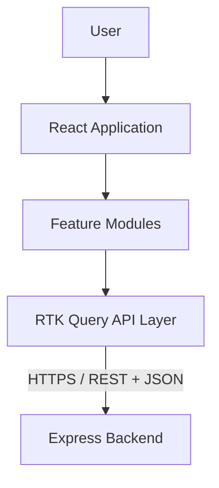
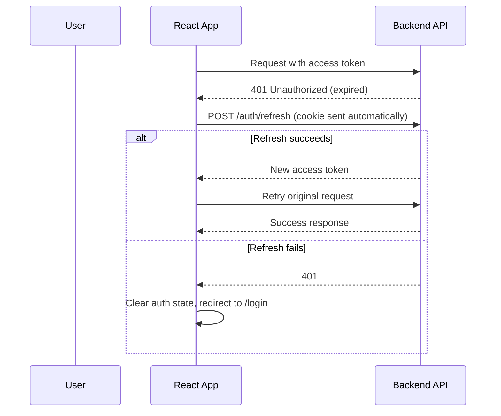

# Frontend Architecture — Expense Splitter (Enhanced)

**Phase:** 1 — System Design
**Milestone:** 1.2
**Status:** Draft
**Depends on:** All Phase 0 documents, SYSTEM_ARCHITECTURE.md (frozen)

---

## 1. Frontend Architecture Overview

The frontend's job in this system is presentation and interaction — it renders state, captures input, and talks to the backend through a typed API layer. It is a consumer of truth, never a producer of it.

**Frontend responsibilities:**
- UI rendering and layout
- Capturing and validating user interaction (client-side, for UX — not authority)
- Application navigation and route protection
- Consuming and caching server state (via RTK Query)
- Optimizing perceived performance and experience (loading states, transitions, skeletons)

**Frontend does NOT own:**
- Balance calculation
- Settlement algorithm output
- Any financial computation
- Authorization decisions (it reflects them, e.g. hiding a button — it never enforces them)
- Database or persistence logic

**Why the backend remains the single source of truth:** every one of these excluded responsibilities is a correctness- or security-critical concern. If the frontend computed a balance and displayed it, that number could drift from the backend's own calculation (different rounding, stale cache, a bug in duplicated logic) — and a financial product cannot tolerate two different "correct" answers existing at once. Authorization enforced only in the client is not authorization at all — it's UI convenience that any request could bypass directly. The frontend reflects backend truth as faithfully and quickly as possible; it never re-derives it.



---

## 2. Frontend Architectural Principles

### Feature-First Architecture
The application is organized around business capabilities (`auth`, `groups`, `expenses`, `settlements`, `analytics`), not technical layers (`components/`, `reducers/`, `services/` at the top level holding everything). Each feature folder owns its own components, API endpoints, schemas, and types.

```
features/
 ├── auth/
 ├── groups/
 ├── expenses/
 ├── settlements/
 └── analytics/
```

**Benefits:** a change to the split-form UI touches only `features/expenses/` — a developer (or reviewer) can understand a feature's full surface area without hunting across parallel technical folders. Ownership is easier to reason about, changes are naturally isolated (reducing merge conflicts and regression risk), and the codebase scales by adding sibling feature folders rather than growing a handful of increasingly bloated shared directories.

### Separation of Concerns
| Layer | Responsibility |
|---|---|
| **Components** (`components/`) | Generic, reusable, no business knowledge (Button, Modal, Card) |
| **Pages** (`pages/`) | Route-level composition only — assemble feature components, own no logic |
| **Features** (`features/*`) | Business-specific components, feature-local hooks, API endpoints, schemas |
| **Hooks** (`hooks/`, feature-local `hooks/`) | Reusable stateful logic, decoupled from any single component |
| **Services** (`services/`) | Cross-cutting client-side utilities that aren't API calls (e.g., formatting, storage helpers) |
| **API layer** (RTK Query endpoints, per feature) | Typed contract with the backend — the only place `fetch`/Axios calls exist |
| **State management** (`app/store.ts`, Redux slices) | Global client state and the RTK Query cache |
| **Utilities** (`utils/`) | Pure, stateless helper functions (date formatting, currency display) |

The rule of thumb: if it renders UI, it's a component; if it composes components for a route, it's a page; if it owns business behavior for one feature, it lives inside that feature folder — nothing business-specific lives in `components/`, `hooks/`, or `utils/` at the top level.

### Single Source of Truth
| State type | Owner |
|---|---|
| Server state (groups, expenses, balances, settlements, analytics) | RTK Query |
| Global client state (auth identity, UI preferences, notifications) | Redux slices |
| Local, ephemeral UI state | React local state |

**Why duplicated server state creates bugs:** if a component reads a group's balance from a plain Redux slice that was populated by an API response, and another part of the app triggers a refetch via RTK Query, the Redux copy silently goes stale — there is no single point that knows it needs updating. RTK Query's cache is the only copy of server data that exists; nothing duplicates it into Redux. This eliminates an entire category of "the UI shows an old number" bugs by construction, not by discipline.

### Type Safety First
TypeScript types flow from a single source: the backend's DTO/response shapes are mirrored (or, ideally, shared via a common types package/OpenAPI-generated types in a more mature setup) into RTK Query endpoint definitions, which then type every hook consuming them — a component destructuring `data.balnce` (typo) fails to compile, not fails silently at runtime. Form schemas (Zod) double as both the runtime validator and the TypeScript type source (`z.infer<>`), so a form's type and its validation logic can never drift apart. Component props are always explicitly typed, never `any` — a component's contract is documented by its type signature.

---

## 3. Frontend Folder Architecture

```
client/
└── src/
    ├── app/
    │   ├── store.ts          # Redux store configuration, RTK Query middleware
    │   ├── router.tsx        # Route tree definition
    │   └── providers.tsx     # App-wide providers (Redux Provider, Router, Toast)
    │
    ├── assets/                # Static images, icons, fonts
    │
    ├── components/
    │   ├── ui/                 # Primitive, styled building blocks (Button, Input, Card)
    │   ├── common/              # Composed but still generic (EmptyState, PageHeader)
    │   └── feedback/            # Loading, error, toast, skeleton components
    │
    ├── features/
    │   ├── auth/
    │   │   ├── components/     # LoginForm, RegisterForm
    │   │   ├── hooks/          # useAuth, useSessionRefresh
    │   │   ├── api/            # authApi.ts (RTK Query endpoints)
    │   │   ├── schemas/        # Zod schemas for login/register
    │   │   ├── types/          # Auth-specific TS types
    │   │   └── authSlice.ts    # Redux slice: current user, auth status
    │   │
    │   ├── groups/
    │   │   ├── components/     # GroupList, GroupCard, MemberManager
    │   │   ├── api/             # groupsApi.ts
    │   │   ├── schemas/
    │   │   └── types/
    │   │
    │   ├── expenses/
    │   │   ├── components/     # ExpenseForm, SplitSelector, ExpenseList
    │   │   ├── api/             # expensesApi.ts
    │   │   ├── schemas/         # per-split-type Zod schemas
    │   │   └── types/
    │   │
    │   ├── settlements/
    │   │   ├── components/     # SettlementCard, SettlementList
    │   │   ├── api/             # settlementsApi.ts
    │   │   └── types/
    │   │
    │   └── analytics/
    │       ├── components/     # CategoryChart, TrendChart, ContributionChart
    │       ├── api/             # analyticsApi.ts
    │       └── types/
    │
    ├── layouts/                # AppLayout, AuthLayout — structural page shells
    ├── pages/                  # Route-level composition (DashboardPage, GroupDetailPage)
    ├── routes/                 # Route guards (ProtectedRoute), route constants
    ├── hooks/                  # Cross-feature reusable hooks (useDebounce, useMediaQuery)
    ├── services/                # Non-API client utilities (localStorage wrapper, currency formatting)
    ├── utils/                   # Pure helper functions
    ├── constants/                # App-wide constants (categories list, route paths)
    ├── types/                    # Shared/global TS types (not feature-specific)
    └── styles/                   # Tailwind config, global CSS, design tokens
```

Every folder above has a distinct, non-overlapping job — there is deliberately no generic `helpers/` or `misc/` catch-all, since those are exactly where architectural intent erodes over time.

---

## 4. Feature Module Architecture

### Auth Feature
**Responsibilities:** login, register, logout, refresh-token lifecycle, exposing auth state to the rest of the app (via `authSlice` + a `useAuth` hook), and gating protected routes.
**Structure:** `components/` (forms), `hooks/` (`useAuth`, session-refresh logic), `api/` (`authApi.ts`), `schemas/` (login/register Zod schemas), `types/`.

### Groups Feature
**Responsibilities:** creating groups, managing membership (add/remove), viewing group details and member lists. Owns the UI for the "who's in this group" question that every other feature (expenses, settlements) depends on for context.

### Expenses Feature
**Responsibilities:** creating, editing, and deleting expenses; the split-method UI specifically, since it's the most complex form surface in the app. `SplitSelector` renders one of three sub-forms based on the chosen method — **equal** (just participant selection, no amounts entered), **unequal** (per-participant amount fields, with a live running total validated against the expense total), **percentage** (per-participant percentage fields, live-validated to sum to 100%). Each sub-form has its own Zod schema (Section 10), but all three compose under one `ExpenseForm`.

### Settlement Feature
**Responsibilities:** displaying settlement suggestions returned by the backend (who pays whom, how much) in a clear, scannable list. **The frontend never calculates settlement** — this feature is a pure display layer over `GET /groups/:id/settlement`, consistent with Section 1's boundary. If a settlement figure ever looked wrong, the fix belongs in the backend's `settleUpAlgorithm.ts`, never in this feature's rendering logic.

### Analytics Feature
**Responsibilities:** rendering charts (Recharts) for category breakdown, monthly trend, and member contribution, using data returned pre-aggregated from the backend's analytics endpoints — the frontend formats and visualizes, it doesn't aggregate raw expense records itself.

---

## 5. State Management Architecture

| State | Owner | Examples |
|---|---|---|
| Server-originated data | RTK Query | groups, expenses, balances, settlements, analytics |
| Global client state | Redux slice | authenticated user identity, auth status, global UI preferences, notification queue |
| Local UI state | React `useState`/`useReducer` | modal open/closed, active form step, dropdown state, unsaved form draft |

### RTK Query
Owns every piece of data that originates from the API. Its lifecycle handles:
- **Caching** — each endpoint's result is cached by its serialized arguments, so navigating away from and back to a group doesn't necessarily refetch.
- **Invalidation** — mutations (creating an expense) declare which cache tags they invalidate (`Expense`, `Balance` for that group), so RTK Query automatically refetches affected queries rather than requiring manual state updates.
- **Refetching** — configurable refetch-on-focus/reconnect behavior keeps balances reasonably current without manual polling logic.
- **Optimistic updates** — used selectively for low-risk, high-frequency interactions (e.g., marking a settlement suggestion as "paid" in the UI immediately, reconciled against the real response) — never used for the balance/settlement numbers themselves, since an optimistic financial figure that later corrects itself is worse UX than a brief loading state.

### Redux Slice
Owns state with no server origin: the currently authenticated user object (post-login, pre-refetch), global UI preferences (e.g., sidebar collapsed state), and an app-wide notification/toast queue.

### React Local State
Owns state that's meaningless outside a single component's lifecycle: whether a modal is open, which tab is active, in-progress (unsubmitted) form field values before they're handed to React Hook Form's own state.

---

## 6. API Layer Architecture

```
services/api/
  baseApi.ts        # RTK Query base configuration: baseUrl, credentials, tag types
  axiosClient.ts     # Configured Axios instance, used only where RTK Query isn't a fit
```

**Base API configuration:** a single RTK Query `createApi` base (`baseApi.ts`) that every feature's endpoints inject into — this ensures one shared cache, one shared base URL, and one shared error/auth-header handling path, rather than each feature reinventing its own fetch configuration.

**Authentication headers:** the access token (held in memory, per Section 7) is attached automatically via the base query's `prepareHeaders`, so individual feature endpoint definitions never manually handle auth headers.

**Refresh token handling:** the base query wraps the standard RTK Query fetch base with re-authentication logic — on a 401 response, it triggers the refresh endpoint, and on success, retries the original request transparently; on refresh failure, it dispatches a logout action and lets route guards redirect. This logic lives once, centrally, not per-feature.

**Concurrency (single-flight refresh):** because refresh tokens rotate on use (Section 5 of `SYSTEM_ARCHITECTURE.md`), multiple requests failing with 401 near-simultaneously must not each trigger their own refresh call — a second refresh attempt using an already-rotated token would fail and incorrectly log the user out. The base query holds a single in-flight refresh promise: the first 401 triggers the actual refresh call, and any concurrent 401s await that same promise rather than issuing their own, then retry their original request once it resolves.

**Error handling:** RTK Query's error shape is normalized at the base-query level into a consistent `{ status, message }` shape before it reaches feature code, so every feature handles errors the same way rather than each parsing raw Axios/fetch error shapes independently.

**Lifecycle:**
```
Component → RTK Query Hook (useCreateExpenseMutation) → API Endpoint (expensesApi) → Backend
```

Axios is reserved for the rare case RTK Query doesn't fit well (e.g., a one-off file upload with progress tracking) — it is not a parallel, competing way to fetch ordinary server data.

---

## 7. Authentication Frontend Architecture

**Access Token:** held in memory only (a Redux slice value, not persisted storage) — lost on hard refresh by design, recovered via a silent refresh call on app load.
**Refresh Token:** httpOnly cookie, invisible to and unmanaged by JavaScript — the browser sends it automatically on requests to the refresh endpoint.

**Frontend responsibilities:**
- Detect an expired/expiring session (a 401 from any request, or proactively before the known access-token lifetime elapses).
- Silently request a refresh via the dedicated endpoint before surfacing any interruption to the user.
- Update auth state (Redux slice) with the new access token on success.
- On refresh failure, clear auth state and redirect to login — this is the only case the user sees an interruption.

**Session restoration on app load:** on initial app mount, the access token doesn't yet exist in memory (a hard refresh clears it by design). The app performs a silent refresh attempt before rendering any route — protected route rendering is gated on this initial attempt resolving (shown as a brief app-level loading state), not on the absence of an access token. This prevents a false "logged out" flash for a user with a valid session who simply reloaded the page.



---

## 8. Routing Architecture

**Public routes:** `/login`, `/register`, `/forgot-password`, `/reset-password`.

**Protected routes** (require authenticated session):
```
/dashboard
/groups/:groupId
/groups/:groupId/expenses
/groups/:groupId/settlement
/groups/:groupId/analytics
```

**Route guards:** a `ProtectedRoute` wrapper component checks auth state before rendering its children — unauthenticated access redirects to `/login`, preserving the intended destination for post-login redirect.

**Lazy loading:** each top-level page (`DashboardPage`, `GroupDetailPage`, etc.) is loaded via `React.lazy` + `Suspense`, so the initial bundle only contains what's needed for the first paint — a user who never visits analytics never downloads the charting library's bundle chunk.

**Nested routes:** group-scoped routes (`expenses`, `settlement`, `analytics`) nest under a `GroupDetailLayout` that fetches group context once and renders shared group navigation, avoiding redundant group-detail fetches per sub-page.

---

## 9. Component Architecture

**UI Components** (`components/ui/`) — fully generic, zero business knowledge: `Button`, `Input`, `Modal`, `Card`, `Table`, `Skeleton`. These could be extracted into a separate design-system package without modification.

**Feature Components** (`features/*/components/`) — business-specific composition of UI components: `ExpenseForm`, `SplitSelector`, `SettlementCard`. These know about domain concepts (splits, groups, balances) but not about routing or page layout.

**Page Components** (`pages/`) — route-level composition only. A page imports feature components and arranges them; it contains no business logic, no direct API calls, and minimal state of its own.

**Responsibility rule:** a component should be describable in one sentence without the word "and" — if `ExpenseForm` also handled navigation after submit *and* toast notifications *and* modal state, that's a signal it's absorbed responsibilities that belong to a page or a hook.

---

## 10. Form Architecture

**Technology:** React Hook Form (performance — uncontrolled inputs, minimal re-renders) + Zod (schema validation, shared with TypeScript types via `z.infer`).

**Schema validation:** each form's Zod schema is the single definition of "what does a valid submission look like" — React Hook Form's resolver consumes it directly, so validation rules are never duplicated between the schema and manual `register()` rules.

**Error handling:** field-level errors render inline from React Hook Form's error state; submission-level errors (a rejected server response) surface as a form-level error message, distinct from field errors, so a user isn't left wondering which field caused a generic failure.

**Reusable form fields:** common field patterns (currency input, member multi-select, category picker) are extracted into shared form components used across features (expense creation, expense editing) rather than reimplemented per form.

**Server validation errors:** even though the frontend validates client-side, a 422-style validation error from the backend is mapped back onto the corresponding form field (matched by field name) — the backend is still authoritative, and the UI reflects that rather than assuming client validation was sufficient.

**Currency precision contract:** all monetary amounts are represented as integer cents (a branded `Cents` type, not a bare `number`) from the point of form submission through the API contract, matching the representation used by the backend's `expenseCalculation.service.ts` — this must be a shared, confirmed contract, not a frontend-only convention. Unequal-split and percentage-split validation (running total vs. expense total; percentages summing to 100%) is performed in this same integer representation (cents for amounts, integer basis points or whole percentages for percentage splits), so the frontend's notion of "valid" can never diverge from the backend's due to independent floating-point rounding. Display-formatted decimal strings (e.g., "$33.34") are derived only at the point of rendering, never used as the underlying validated value.

**Example — expense creation form fields:** `amount`, `description`, `category`, `payer`, `splitMethod` (equal/unequal/percentage), `participants` (with per-method sub-fields as described in Section 4).

---

## 11. Styling Architecture

**Approach:** Tailwind CSS with a constrained design-token layer — a defined color palette, spacing scale, and typography scale configured in `tailwind.config` (or Tailwind v4's CSS-based theme), not the full default Tailwind palette used ad hoc.

**Design tokens:** semantic color tokens (`primary`, `surface`, `danger`, `success`) rather than raw Tailwind color utilities scattered through components — a balance shown as "owed" vs. "owing" uses `text-success`/`text-danger` tokens consistently, not component-by-component color choices.

**Spacing and typography systems:** a fixed spacing scale and type scale applied consistently, so vertical rhythm and hierarchy feel intentional across features rather than each form/page inventing its own spacing.

**Responsive strategy:** mobile-first utility application, with breakpoints reserved for genuine layout shifts (e.g., a group's expense list collapsing to a card layout on small screens) rather than reflexive `sm:`/`md:` prefixes on every element.

**Discipline:** utility classes are composed through shared UI components (Section 9), not copy-pasted class strings across features — if three components share the same utility combination, that combination becomes a `components/ui/` primitive, not a repeated string.

---

## 12. Performance Architecture

- **`React.lazy` + code splitting** at the page level (Section 8), keeping initial bundle size proportional to what a first-time visitor actually needs.
- **Memoization** (`useMemo`/`React.memo`) applied selectively to expensive derived computations (e.g., formatting a large expense list for display) — not applied reflexively to every component, which would add complexity without measurable benefit.
- **Virtualization** for long lists (a group with hundreds of expenses) to avoid rendering off-screen DOM nodes.
- **RTK Query caching** (Section 5/6) avoids redundant network requests for data the user has already fetched recently.
- **Avoiding unnecessary renders** via careful state colocation — state lives as close as possible to where it's used, so a keystroke in one form field doesn't re-render an unrelated part of the page.

---

## 13. Error Handling Architecture

- **API errors** — normalized at the API layer (Section 6) into a consistent shape, surfaced via toast notifications for transient/actionable errors and inline messaging for form-specific errors.
- **Validation errors** — handled at the form level (Section 10), both client-predicted and server-confirmed.
- **Network errors** (offline, timeout) — caught by RTK Query's error states and surfaced with a distinct, retryable message rather than a generic failure.
- **Unauthorized errors** — a 401 outside the refresh flow's recoverable case (Section 7) triggers a redirect to login, not a raw error message.
- **Global error handling:** an application-level Error Boundary catches unexpected render-time exceptions and displays a graceful fallback rather than a blank white screen — this is the last line of defense, not the primary error-handling mechanism.

---

## 14. Loading State Architecture

- **Page loading** — a full-page skeleton or spinner only during the initial route-level data fetch (e.g., first load of a group's detail page).
- **Button loading** — inline spinner/disabled state on the specific button triggering a mutation (e.g., "Create Expense" while submitting), so the rest of the UI stays interactive.
- **Skeleton loading** — used for content areas with a known shape (expense list, balance cards) so the layout doesn't jump once data arrives.
- **Background refetching** — RTK Query refetches (on refocus/reconnect) happen without disrupting already-rendered content — a subtle refresh indicator at most, never a full-page loading state for data the user is already looking at.

**Why not one global spinner:** a single global loading state treats a full-page navigation and a single-button click as the same event, which either over-signals (blocking the whole UI for a small mutation) or under-signals (no feedback on the specific action the user just took). Granular loading states keep feedback proportional to the action.

---

## 15. Testing Strategy

**Tooling:** Vitest + React Testing Library for unit, component, and integration tests; Playwright for E2E. Vitest is chosen over Jest for native Vite integration (shared config, no separate transform pipeline) — consistent with the Vite-based build already in place; Playwright is chosen over Cypress for its multi-browser support and generally faster, more reliable headless execution in CI.

- **Unit tests** (Vitest) — pure utility functions (currency formatting, date helpers) and custom hooks in isolation (`useAuth`, `useDebounce`).
- **Component tests** (Vitest + React Testing Library) — forms (validation behavior, error display) and interactive components (`SplitSelector` switching between split modes correctly).
- **Integration tests** (Vitest + React Testing Library) — feature-level flows within a single feature module (e.g., creating an expense end-to-end within the `expenses` feature, mocked API layer).
- **E2E tests** (Playwright, a small, high-value set, not exhaustive coverage) — authentication (register → login → protected route access), expense creation (full flow through to balance update reflected in UI), and the settlement flow (viewing and marking a suggestion as settled) — these three are chosen because they're the core loop from `FEATURE_REQUIREMENTS.md`, not because E2E coverage should be broad.

**Convention:** test files are colocated with the code under test (`Component.test.tsx` beside `Component.tsx`), not held in a parallel top-level `__tests__/` tree — consistent with the feature-first discoverability principle in Section 2.

---

## 16. Accessibility Architecture

- **Semantic HTML** — forms use real `<form>`/`<label>`/`<button>` elements, not `<div>`s with click handlers; lists use `<ul>`/`<li>` where appropriate.
- **Keyboard navigation** — all interactive elements (including custom components like `SplitSelector`) are reachable and operable via keyboard alone, not just mouse/touch.
- **ARIA** — applied only where semantic HTML is insufficient (e.g., custom dropdown/select components), not added reflexively to elements that already carry native semantics.
- **Focus management** — modals trap and restore focus correctly; route changes move focus to the new page's main heading rather than leaving it stranded.
- **Color contrast** — the design token palette (Section 11) is chosen to meet WCAG AA contrast ratios by default, so individual components don't need to re-verify contrast ad hoc.

---

## 17. Security Considerations

- **No sensitive data in localStorage/sessionStorage** — the access token lives in memory only (Section 7); nothing token-related touches persistent browser storage.
- **No tokens in localStorage** — called out explicitly because it's the most common real-world mistake in JWT-based frontends, and the specific vector the httpOnly-cookie refresh strategy exists to avoid.
- **XSS prevention** — React's default JSX escaping is relied upon; any use of `dangerouslySetInnerHTML` is avoided entirely for this application, since no feature requires rendering raw HTML.
- **Input sanitization** — handled primarily as a backend responsibility (Section 6 of `SYSTEM_ARCHITECTURE.md`), with frontend validation (Zod) as a UX layer, not a security boundary, consistent with Section 1's client/server truth boundary.
- **Secure API communication** — all requests over HTTPS in production; cookies scoped `Secure` and `SameSite` appropriately for the refresh token.

---

## 18. Architectural Decisions Record

### ADR-001 — Feature-Based Frontend Architecture
**Decision:** Organize the codebase by business feature (`features/auth`, `features/expenses`, etc.) rather than by technical layer.
**Reason:** Feature-first organization keeps related code physically close, isolates changes, and scales naturally as features are added — consistent with Section 2's reasoning.
**Alternative considered:** Technical-layer organization (`components/`, `reducers/`, `containers/` at the top level holding all features' code intermixed).
**Why rejected:** As the app grows, technical-layer folders become large, undifferentiated directories where finding "everything related to expenses" requires searching across several top-level folders — actively working against maintainability at any real scale.

### ADR-002 — RTK Query for Server State
**Decision:** All server-originated data is owned and cached by RTK Query, not manually fetched and stored in Redux slices.
**Reason:** Built-in caching, invalidation, and refetching eliminate a large class of manual state-synchronization bugs (Section 5).
**Alternative considered:** Manual `fetch`/Axios calls dispatched into plain Redux slices via thunks.
**Why rejected:** Requires hand-rolling cache invalidation, loading/error state, and refetch logic per endpoint — solved problems that RTK Query provides out of the box, with less code and less room for state-sync bugs.

### ADR-003 — Redux Reserved for Client-Only State
**Decision:** Redux (plain slices) holds only state with no server origin (auth identity, UI preferences, notifications).
**Reason:** Keeps a strict single-source-of-truth boundary (Section 5) — server data has exactly one home (RTK Query's cache).
**Alternative considered:** Using Redux slices for both client state and a manually-synced copy of server state.
**Why rejected:** This is the exact duplication pattern that produces stale-UI bugs; there's no benefit to a second copy of data RTK Query already caches correctly.

### ADR-004 — React Hook Form + Zod for Form Handling
**Decision:** All forms use React Hook Form for state/performance and Zod for schema validation, with types derived from the schema.
**Reason:** Minimizes re-renders on typing (uncontrolled inputs), and a single schema serves as both runtime validation and the TypeScript type source, preventing validation/type drift.
**Alternative considered:** Formik, or fully controlled components with manual validation logic.
**Why rejected:** Formik's controlled-component model re-renders more on every keystroke; manual validation logic duplicates what a schema-based approach gives for free, and risks the schema and TS types diverging over time.

### ADR-005 — TypeScript Strict Mode
**Decision:** The frontend TypeScript configuration runs in strict mode (`strict: true` and related flags) from project start.
**Reason:** Strict mode catches null/undefined mishandling and implicit `any` usage at compile time — exactly the class of bug that's expensive to track down at runtime in a financial application where a silently-undefined amount is a real correctness risk.
**Alternative considered:** Non-strict/gradual typing, tightened later.
**Why rejected:** Retrofitting strict mode onto an already-large codebase is significantly more effort than starting with it — the cost of strict mode is front-loaded and small; the cost of adding it later compounds with codebase size.

### ADR-006 — Single-Flight Refresh Token Handling
**Decision:** Concurrent 401 responses share a single in-flight refresh request rather than each triggering their own refresh call.
**Reason:** Refresh tokens rotate on use; naive per-request refresh handling would cause concurrent requests to race for a single-use token, incorrectly logging out users with valid sessions under normal concurrent-request conditions (Section 6).
**Alternative considered:** Each 401 independently calls the refresh endpoint.
**Why rejected:** Directly incompatible with token rotation as specified in `SYSTEM_ARCHITECTURE.md` — would produce intermittent, hard-to-reproduce forced logouts in production.

### ADR-007 — Vitest + React Testing Library + Playwright for Testing
**Decision:** Vitest and React Testing Library for unit/component/integration tests; Playwright for E2E.
**Reason:** Vitest shares configuration and transform pipeline with the existing Vite build, avoiding a second, divergent build setup; Playwright offers multi-browser support and generally more reliable headless CI execution than the alternative.
**Alternative considered:** Jest + Cypress.
**Why rejected:** Jest requires a separate transform configuration parallel to Vite's, duplicating build configuration for no corresponding benefit; Cypress's single-browser (Chromium-first) model and historically heavier CI runtime make Playwright the better fit for a project already optimizing for lean tooling.

---

## 19. Environment Configuration & Explicit V1 Non-Goals

**Environment configuration:** the API base URL and any environment-dependent frontend values are supplied via Vite's `import.meta.env` mechanism, with separate `.env` files for development and production builds — never hardcoded. This mirrors the environment-separation discipline described for the backend in `SYSTEM_ARCHITECTURE.md` Section 8.

**Explicit non-goals for V1** (deliberately excluded, not overlooked — consistent with the MVP discipline in `VISION.md`):
- **Dark mode** — the semantic design-token approach (Section 11) makes this cheap to add later; deferred rather than built now.
- **Product usage analytics** (tracking clicks/funnels — distinct from the in-app Analytics *feature*, which is a core V1 capability) — not needed to prove the core loop.
- **Internationalization (i18n)** — single-language for V1, consistent with the scope boundaries in `FEATURE_REQUIREMENTS.md`.
- **Offline support** — graceful network-error messaging (Section 13) is sufficient; true offline functionality is out of scope.
- **Route-level error boundaries beyond the global one, product monitoring, and client-side error-reporting integration** are recommended future improvements (tracked outside this document) rather than V1 blockers — a minimal client-side error log stub may be added during Phase 4 implementation without requiring an architecture change.
