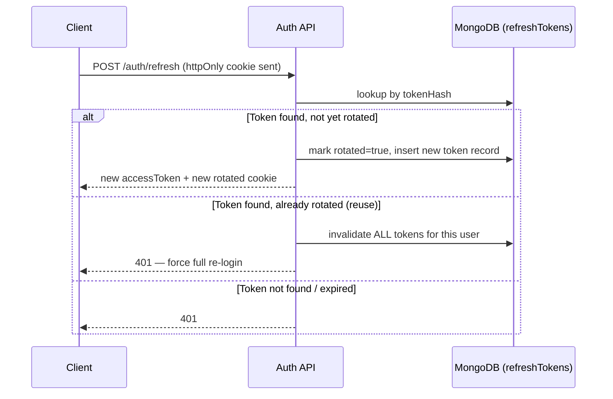

# Security Architecture — Expense Splitter (Enhanced)

**Phase:** 1 — System Design
**Milestone:** 1.6 (final Phase 1 document)
**Status:** Draft
**Depends on:** SYSTEM_ARCHITECTURE.md, FRONTEND_ARCHITECTURE.md, BACKEND_ARCHITECTURE.md, DATABASE_DESIGN.md, API_SPECIFICATION.md (frozen)

> **Resolving the carried-forward open item:** `API_SPECIFICATION.md` flagged whether a group can reach zero active members via self-removal. Resolved here, in Section 5, as a security/authorization decision: **removal is allowed unconditionally, including the last active member.** A zero-active-member group becomes unreachable (no one can pass the active-membership authorization check to view or act on it) but its data is never deleted — this is consistent with the product having no group-deletion capability in V1 (`DATABASE_DESIGN.md` Section 16) and requires no additional guard logic, which keeps the authorization model uniform (every membership action uses the same rule) rather than adding a special case for a rare, low-harm edge state.

---

## 1. Security Architecture Overview

**Security goals:** protect user identity and credentials, guarantee that financial data (amounts, splits, balances, settlements) can only ever be produced by the backend's own trusted calculation logic, and ensure that access to any group's data is strictly limited to that group's current or historical members, consistent with the soft-removal model.

**Security principles:** defense in depth (no single control is the only thing standing between an attacker and sensitive data), least privilege (every credential — database user, JWT scope — grants only what's needed), fail closed (an ambiguous or failed check denies access rather than defaulting to allow), and never trust client input for anything that determines a financial outcome (Section 8 elaborates — this is the principle that matters most for this specific product).

**Defense-in-depth strategy, restated as layers:**
```
Infrastructure (HTTPS, Atlas network restrictions)
  → API layer (Helmet, CORS, rate limiting)
    → Authentication (JWT verification)
      → Authorization (group membership checks)
        → Validation (Zod, request boundary)
          → Business logic (service-layer rules — split sums, membership state)
            → Database (schema-level constraints, least-privilege DB user)
```
An attacker must defeat multiple independent layers to reach or corrupt sensitive data — no layer is assumed sufficient on its own.

**Security boundaries:**
- **Application layer** — the React frontend never holds authority (`FRONTEND_ARCHITECTURE.md` Section 1); it's a rendering surface, not a security boundary.
- **API layer** — the actual boundary between untrusted input and trusted computation; every request is authenticated, authorized, and validated here before reaching business logic.
- **Database layer** — the last line of defense (`BACKEND_ARCHITECTURE.md` Section 13); schema-level constraints catch anything that somehow bypassed the layers above.
- **Infrastructure layer** — network-level restrictions (Atlas IP allowlisting, HTTPS-only) protect the transport and hosting environment itself.

---

## 2. Authentication Security Architecture

### Registration
- **Email validation:** format-validated via Zod at the request boundary; uniqueness enforced at the database level (`users.email` unique index, `DATABASE_DESIGN.md` Section 13) as well as checked in the service layer, so a race condition between two near-simultaneous registrations with the same email still fails safely (the unique index rejects the second write even if the service-layer check passed for both).
- **Password policy:** minimum length and complexity enforced via the Zod schema at registration (exact thresholds are an implementation-stage constant, not an architectural decision) — the policy exists to reduce trivially-guessable passwords without being so strict it drives users toward insecure workarounds (writing passwords down, reusing across services more aggressively).
- **Password hashing:** bcrypt, applied before the password ever reaches persistence — the plaintext password exists only in memory for the duration of the request and is never logged (Section 11) or written anywhere unhashed.
- **Account creation security:** registration does not auto-issue tokens (`BACKEND_ARCHITECTURE.md` Section 5) — a newly created account must explicitly log in, which avoids any ambiguity about whether account creation and session creation are the same trust event.

### Login
- **Credential verification:** email lookup followed by a bcrypt comparison of the submitted password against the stored hash — never a plaintext comparison, never a lookup keyed by password.
- **Timing attack prevention:** bcrypt's comparison itself is designed to run in a consistent time regardless of where a mismatch occurs, which is the primary defense; additionally, the service performs a bcrypt comparison against a dummy hash even when the email lookup fails (no matching user), so the response time for "wrong password" and "no such account" is not meaningfully distinguishable — this prevents an attacker from using response timing to enumerate valid emails.
- **Failed login handling:** failed attempts are logged as security events (Section 11) but do not lock the account after a fixed threshold in V1 — account lockout is a denial-of-service vector in its own right (an attacker can lock out a legitimate user by deliberately failing their login repeatedly); rate limiting (below) is the chosen mitigation instead, consistent with avoiding unnecessary complexity for a solo-developer-scoped product.
- **Rate limiting:** per Section 6 — authentication endpoints carry a stricter limit than general API routes.

### JWT Architecture
- **Access token purpose:** proves identity for the duration of a single short session window; stateless — verified by signature alone, no database lookup required per request (this is what keeps authenticated requests fast).
- **Access token lifetime:** short (≈15 minutes, `BACKEND_ARCHITECTURE.md` Section 5) — bounds the damage window of a leaked token to a small, self-expiring interval.
- **JWT payload structure:** minimal claims only — user id (`sub`), issued-at (`iat`), expiry (`exp`). No email, name, role, or any other profile/business data is embedded, since a JWT payload is base64-encoded, not encrypted, and readable by anyone holding the token.
- **JWT signing strategy:** HMAC-SHA256 (HS256) with a single strong server-side secret — sufficient and simpler than an asymmetric (RS256) scheme, since this is a single-backend monolith (`BACKEND_ARCHITECTURE.md` ADR-001) with no third-party service needing to verify tokens independently; RS256's public/private key separation would add operational complexity with no corresponding benefit here.
- **Secret management:** the signing secret is a long, random, environment-provided value (Section 10), validated present and sufficiently long at server startup (`BACKEND_ARCHITECTURE.md` Section 16) — never hardcoded, never committed.

### Refresh Token Security
- **httpOnly cookie strategy:** the refresh token is set via `Set-Cookie` with the `HttpOnly` flag, making it inaccessible to any JavaScript running on the page — this is the primary defense against token exfiltration via XSS, since even a successful script injection cannot read this cookie's value.
- **Secure flag:** the cookie is marked `Secure`, so browsers will never transmit it over a plain HTTP connection — relevant even though production is HTTPS-only, as a defense against any accidental HTTP fallback.
- **SameSite policy:** `SameSite=Strict` (or `Lax` if a cross-site top-level navigation flow is ever needed, though V1's frontend-backend relationship doesn't require it) — the cookie is not sent on cross-site requests, which is the primary structural defense against CSRF for this specific cookie (elaborated in Section 7).
- **Token hashing:** only a hash of the refresh token is persisted (`DATABASE_DESIGN.md` Section 10) — a database compromise alone does not yield usable tokens.
- **Rotation strategy:** every refresh issues a new token and invalidates the one just used (`BACKEND_ARCHITECTURE.md` Section 5) — a refresh token is single-use.
- **Reuse detection:** presenting an already-rotated (used) token is treated as a theft signal; the response is to invalidate all of that user's active refresh tokens, forcing full re-authentication everywhere.
- **Session invalidation:** logout explicitly invalidates the server-side token record (not just clearing the client cookie); password reset also invalidates all sessions (Section 3).



---

## 3. Password Security

- **Hashing algorithm:** bcrypt — a deliberately slow, adaptive hashing algorithm designed for password storage specifically (as opposed to a fast general-purpose hash like SHA-256, which is unsuitable for passwords precisely because its speed makes brute-forcing cheap).
- **Salt strategy:** bcrypt generates and embeds a unique salt per hash automatically — no separate salt storage or management is needed; two users with the same password produce different stored hashes.
- **Password storage rules:** only the bcrypt hash is ever persisted (`users.passwordHash`); the plaintext value is discarded the moment hashing completes and is never logged, never included in any response, and excluded from serialization at the schema level (`DATABASE_DESIGN.md` Section 6).
- **Password reset security:** a single-use, hashed, time-limited token (Section 2's refresh-token hashing rationale applies identically here) — knowledge of the token is required to reset, and it's invalidated after one use regardless of outcome.
- **Password change flow:** (via reset, since V1 has no separate "change password while logged in" endpoint per `API_SPECIFICATION.md`'s scope) always invalidates all active sessions — a password change is a strong enough trust event that every existing session should require re-authentication under the new credential.
- **Account takeover prevention:** the combination of bcrypt hashing (making stolen hashes expensive to crack), rate-limited login (making online guessing slow), and full-session invalidation on password reset (closing any session an attacker may have already established) together form the takeover-resistance strategy — no single control alone is treated as sufficient.

**Why plaintext passwords are impossible:** the password is transformed by bcrypt synchronously within the registration/reset service function, before any database write occurs — there is no code path in the architecture where a plaintext password reaches persistence, logging, or an API response; the schema-level exclusion of `passwordHash` from serialization (`DATABASE_DESIGN.md` Section 6) is a second, independent safeguard against the hash itself ever leaking, let alone the plaintext.

---

## 4. Authorization Architecture

**Authentication vs. Authorization:** authentication (JWT verification) answers "who is making this request" — it runs once, uniformly, for every protected endpoint. Authorization answers "is this specific identity allowed to do this specific thing to this specific resource" — it's resource-specific and runs after authentication, in the service layer (`BACKEND_ARCHITECTURE.md` Section 6). A valid access token alone never grants access to group-scoped data — it only proves identity.

**Permission matrix:**

| Resource | Action | Required Permission |
|---|---|---|
| User (own profile) | View / Update | Self (authenticated as that user) |
| Group | Create | Any authenticated user |
| Group | View / Update | Active member |
| Member | Add | Active member |
| Member | Remove (self or other) | Active member |
| Expense | Create | Active member (requester); payer and split participants must be current or former group members |
| Expense | View / Edit / Delete | Active member |
| Balance | View | Active member |
| Settlement suggestion | View | Active member |
| Settlement (record completed) | Create | Active member |
| Settlement history | View | Active member |
| Analytics | View | Active member |

No resource in V1 has a permission tier stricter than "active member" — there is no owner/admin role (`BACKEND_ARCHITECTURE.md` Section 6), so this matrix is intentionally flat rather than hierarchical.

---

## 5. Group Membership Security Model

**Active member rules:** authorization for every group-scoped action (Section 4) checks `Group.members` for an entry matching the requester's user id with `status: 'active'` — this check is performed in the service layer, on every request, not cached or assumed from a prior check earlier in the session.

**Removed member restrictions:** once a member's status transitions to `'removed'`, every subsequent authorization check for that group fails for that user — they cannot view the group, its expenses, balances, settlements, or analytics, and cannot create new expenses or settlements within it, even though their historical data remains in the system.

**Historical data access:** a removed member's *past* contributions (as `payer` or in `splitAmong` on existing expenses, or as `from`/`to` on existing settlements) remain visible to *current* active members viewing group history — this is intentional (the audit-trail requirement from `USER_PERSONAS.md`'s Team Collaborator persona) and is distinct from the removed member's own ability to access the group, which is fully revoked.

**Membership validation:** performed fresh on every request via a direct query against the group's current `members` array state — never inferred from a JWT claim or cached session data, since membership can change between one request and the next (a user could be removed mid-session), and the access token itself carries no group-membership information (Section 2's minimal-payload principle).

**Preventing unauthorized access after removal — why removed members cannot access previous group resources:** removal is a state transition checked at request time, not a point-in-time snapshot baked into any credential. Because the access token's payload contains only user identity (not group memberships), a removed member's still-valid, unexpired access token proves *who they are* but is re-evaluated against *current* group state on every group-scoped request — so removal takes effect immediately for future requests, without requiring the access token itself to be revoked or the user to be logged out. This is a direct consequence of the JWT-minimal-payload and per-request-authorization design choices working together.

---

## 6. API Security Architecture

### Request Protection
- **Request validation:** every mutating endpoint validates its full request body/params/query via Zod (`API_SPECIFICATION.md`, per-endpoint) before any business logic runs.
- **Zod validation flow:** validation middleware runs after authentication/authorization (`BACKEND_ARCHITECTURE.md` Section 7's stated order) but before the controller — an invalid request from an unauthenticated caller is rejected by authentication first, so validation logic never runs against a request that shouldn't reach the system at all.
- **Payload size limits:** the Express JSON body parser is configured with a reasonable max payload size (e.g., 100KB — generous for this application's text-and-number-only request bodies, since no endpoint accepts file uploads in V1) to prevent trivial memory-exhaustion attempts via oversized bodies.
- **Malformed request handling:** a body that fails to parse as JSON, or fails Zod validation, returns `400` with the standard error envelope (`API_SPECIFICATION.md` Section 3) — never a raw parser exception reaching the client.

### HTTP Security
- **Helmet configuration:** applied globally, first in the middleware chain (`BACKEND_ARCHITECTURE.md` Section 7) — sets secure defaults for the headers below.
- **Security headers / HSTS:** `Strict-Transport-Security` enabled in production, instructing browsers to only ever connect over HTTPS for this domain going forward — mitigates protocol-downgrade attacks.
- **CSP strategy:** a Content-Security-Policy restricting script/style sources to the application's own origin (and any explicitly trusted CDN, if the frontend build requires one) — a defense-in-depth measure against XSS specifically (Section 7), since even if an injection point existed, CSP would block execution of a script from an untrusted origin.
- **X-Frame-Options:** set to `DENY` — the application has no legitimate reason to be embedded in an iframe, and denying it outright prevents clickjacking attempts.
- **Referrer-Policy:** set to a restrictive value (e.g., `strict-origin-when-cross-origin`) so URLs (which could contain sensitive path segments like group IDs) aren't leaked in full to third-party sites via the `Referer` header on outbound navigation.

### CORS Strategy
- **Allowed origins:** in production, restricted to the exact deployed frontend origin — never a wildcard (`BACKEND_ARCHITECTURE.md` Section 16); in development, `localhost` at the Vite dev server's port is explicitly allowed.
- **Credentials handling:** `credentials: true` is required (since the refresh-token cookie must be sent cross-origin between the frontend and API domains, if they're deployed to different domains/subdomains) — this makes the exact-origin restriction above non-negotiable, since CORS forbids combining a wildcard origin with credentialed requests.
- **Production configuration:** CORS origin is environment-driven (Section 10), never hardcoded, so the same codebase deploys correctly to any environment by configuration alone.

### Rate Limiting
- **Authentication routes** (`register`, `login`, `forgot-password`, `reset-password`) — a strict limit (e.g., 5–10 requests per 15 minutes) keyed by IP address, since these are the routes most valuable to an attacker attempting credential stuffing or account enumeration, and are used infrequently enough by legitimate users that a strict limit causes negligible friction.
- **General API routes** (all CRUD operations) — a lighter limit (e.g., 100 requests per 15 minutes) keyed by authenticated user id rather than IP, since a legitimate user may share an IP with others (shared network) but should still be individually bounded — appropriate once a request is authenticated.
- **IP-based vs. user-based limiting:** IP-based limiting is used specifically for pre-authentication routes (there's no user id yet to key on); user-based limiting is used post-authentication, since it more accurately targets abuse by a specific account without penalizing other users on the same network.
- **Abuse prevention:** rate limit rejections return `429` with a distinct `errorCode` (`API_SPECIFICATION.md` Section 3), logged as a security event (Section 11) when a limit is hit repeatedly by the same key, which is a useful signal of sustained abuse attempts worth reviewing.

---

## 7. Injection & Attack Prevention

### NoSQL Injection
Mongoose's query-building API (used exclusively — no raw MongoDB driver queries constructed from string concatenation anywhere in the architecture, per `BACKEND_ARCHITECTURE.md` Section 8's repository pattern) parameterizes query values rather than interpolating them into a query string, which is the primary structural defense. Additionally, Zod validation (Section 6) constrains every input field to its expected type *before* it reaches a repository — a request body field expected to be a string that instead contains a MongoDB query operator object (e.g., `{ "$ne": null }`, the classic NoSQL-injection pattern against a login field) is rejected by Zod's type check, never reaching a query at all.

### XSS Prevention
React's JSX escapes all rendered content by default (`FRONTEND_ARCHITECTURE.md` Section 17) — user-generated content (expense descriptions, group names) is never inserted via `dangerouslySetInnerHTML`, so it's rendered as inert text, not executable markup, regardless of its content. Sanitization on the backend is limited to length/type constraints (Zod) rather than HTML-stripping, since the frontend never interprets stored text as HTML in the first place — there's no rendering context in this application where sanitization-for-HTML-safety is a meaningful additional layer beyond React's default escaping.

### CSRF Protection
**Why httpOnly cookies create CSRF considerations:** an httpOnly cookie is still automatically attached by the browser to same-site requests, meaning a malicious third-party site could theoretically trigger a request to this API from a logged-in user's browser, and the refresh cookie would be sent along — the httpOnly flag prevents *reading* the cookie via script, but doesn't by itself prevent it from being *sent*.

**SameSite strategy:** `SameSite=Strict` (Section 2) is the primary defense — it prevents the browser from attaching the cookie to any cross-site request at all, which neutralizes the classic CSRF vector directly at the browser level, without requiring a separate CSRF token mechanism.

**Additional protection:** because the access token (the credential actually used to authorize state-changing requests, per `API_SPECIFICATION.md`) is sent via an `Authorization: Bearer` header — not a cookie — and headers are not automatically attached by the browser to cross-site requests the way cookies are, the vast majority of state-changing endpoints (everything except `/auth/refresh` and `/auth/logout`, which rely on the cookie) are inherently unreachable via a classic CSRF vector regardless of `SameSite` behavior. A dedicated CSRF token scheme (e.g., double-submit cookie) is therefore judged unnecessary — the combination of `SameSite=Strict` and bearer-token-based authorization for all business-logic endpoints already closes this vector without additional mechanism, consistent with avoiding unnecessary complexity for this project's scope.

### Brute Force Protection
- **Login abuse** — rate limiting (Section 6) plus bcrypt's inherent slowness (Section 3) together make both online and offline brute-forcing impractical at meaningful scale.
- **Password reset abuse** — rate limited identically to login; the "always return success" response (`API_SPECIFICATION.md` Section 7) prevents an attacker from using the endpoint to enumerate which emails have accounts.
- **Account enumeration prevention** — both the login timing-consistency measure (Section 2) and the forgot-password uniform-response behavior are specifically designed so that response content and response time never reveal whether a given email is registered.

---

## 8. Financial Data Security

**Why financial calculations must never trust client input:** the frontend is explicitly not a source of truth for anything financial (`FRONTEND_ARCHITECTURE.md` Section 1) — every value that determines a balance or settlement outcome is recomputed and re-validated server-side, regardless of what the client submitted or displayed.

- **`amountCents` integrity** — every monetary field is validated as a positive integer at both the Zod boundary and the Mongoose schema layer (`DATABASE_DESIGN.md` Section 15); no code path accepts a float or a value implying sub-cent precision.
- **Expense manipulation prevention** — a split's correctness (`sum(splitAmong) === amountCents`) is recalculated and re-validated by `expenseCalculation.service.ts` on every create *and* every edit (`BACKEND_ARCHITECTURE.md` Section 9's full-recalculation-on-edit rule) — a client cannot submit a pre-computed `splitAmong` array and have it trusted directly; the server always derives it fresh from the split method and its inputs.
- **Split calculation trust boundary:** the trust boundary sits precisely at the *inputs* to the split calculation (total amount, method, participants/shares/percentages as submitted) — everything downstream of that boundary (the actual per-member cent allocation) is server-computed and never client-supplied, even implicitly.
- **Balance calculation security:** balances are never accepted as input from any endpoint (there is no "set balance" operation anywhere in `API_SPECIFICATION.md`) — they exist only as a read-time aggregation output (`BACKEND_ARCHITECTURE.md` Section 11), making them structurally impossible to directly manipulate via the API.
- **Settlement verification:** `POST /groups/:groupId/settlements` (`API_SPECIFICATION.md` Section 13) accepts a `from`/`to`/`amountCents` triple from the client (since recording *that* a real-world payment happened is inherently a client-reported event — the system can't observe an external payment itself), but validates that `from` and `to` are legitimate group members before persisting; it does not validate the amount against the current settlement suggestion, since a partial or off-suggestion payment (a real-world possibility — people don't always pay the exact suggested amount) is a legitimate use case, not an attack. This is a deliberate, narrow exception to "never trust client input for financial data," scoped specifically to recording a real-world event rather than computing one.

---

## 9. Database Security

**MongoDB Atlas security:**
- **Network restrictions** — IP allowlisting (or VPC peering for a more advanced setup) restricts which hosts can even attempt a connection to the cluster.
- **Database user permissions / least privilege** — the application connects with a database user scoped to read/write on this project's specific database only, never a cluster-admin credential (`BACKEND_ARCHITECTURE.md` Section 16) — a compromised application credential cannot be used to affect other databases or cluster-level settings.
- **TLS** — enforced by default for all Atlas connections; no unencrypted connection path exists.
- **Connection security** — the connection string (including embedded credentials) is supplied via environment variable (Section 10), never hardcoded or logged.

**Application-level protections:**
- **Sensitive field protection** — `passwordHash`, refresh/reset `tokenHash` values, and any other credential-adjacent field are structurally excluded from API serialization via schema-level transforms (`DATABASE_DESIGN.md` Section 6), not just conventionally omitted by each endpoint's controller.
- **PasswordHash exclusion** — restated as its own point given its criticality: this exclusion is enforced once, at the model level, so it cannot be forgotten on a per-endpoint basis as new endpoints are added over time.
- **Token storage security** — both refresh and password-reset tokens are stored only as hashes (Sections 2–3), consistent with treating the database itself as a potential compromise surface that shouldn't alone be sufficient to grant an attacker usable credentials.

---

## 10. Environment & Secret Management

**Protected secrets:** JWT signing secret, MongoDB connection string/credentials, cookie-signing values (if used), and any future third-party API keys.

**Rules:**
- **Never commit secrets** — all of the above are supplied exclusively via environment variables, injected by the hosting platform at deploy time (`BACKEND_ARCHITECTURE.md` Section 21); `.env` files used for local development are git-ignored, never committed.
- **Environment validation** — a Zod-validated configuration schema (`BACKEND_ARCHITECTURE.md` Section 16) checks that every required secret is present and minimally well-formed (e.g., the JWT secret meets a minimum length) at server startup, so a missing or malformed secret fails the deploy immediately and loudly rather than causing a subtle runtime failure later.
- **Secret rotation strategy** — the JWT signing secret can be rotated by updating the environment variable and redeploying; because access tokens are short-lived (Section 2), a rotation invalidates all existing access tokens within one token lifetime (≈15 minutes) at most, which is an acceptable, self-resolving transition window rather than requiring a dual-secret grace-period mechanism at this project's scale.

---

## 11. Logging & Monitoring Security

**Allowed to log:** request metadata (method, path, status code, response time, non-sensitive identifiers like user id or group id), error codes and messages (from the standard error envelope), and explicitly-flagged security events (below).

**Never logged, under any circumstance:** plaintext or hashed passwords, raw JWT access tokens, raw or hashed refresh/reset tokens, cookie contents, or any other credential material — Winston's log formatting (`BACKEND_ARCHITECTURE.md` Section 18) is configured to never include these fields even at debug level, since a debug-level logging mistake that captures a raw token would defeat every other protection in this document.

**Authentication failure logs:** failed login attempts, failed token verifications, and refresh-token reuse detections (Section 2) are logged at `warn`/`error` level with enough context (user id if known, IP, timestamp — never the attempted password) to support later review.

**Suspicious activity monitoring:** repeated rate-limit triggers from the same key (IP or user, Section 6), and any refresh-token reuse event, are the two signals explicitly called out as worth reviewing — consistent with `BACKEND_ARCHITECTURE.md` Section 18's stance that these are logged distinctly from ordinary request logs, not buried in general request-log volume.

**Production debugging strategy:** production log verbosity is reduced (warn and above, per `BACKEND_ARCHITECTURE.md` Section 18) specifically so that sensitive-adjacent debug-level detail that might be useful in development is never emitted in a production environment where log access itself becomes an additional attack surface to protect.

---

## 12. Threat Model

| Threat | Impact | Probability | Mitigation |
|---|---|---|---|
| Account takeover (credential theft) | High — full account/financial data access | Medium | bcrypt hashing, rate-limited login, timing-attack-resistant verification (Section 2–3) |
| Access token theft (e.g., via XSS) | Medium — bounded by short token lifetime | Low–Medium | Short (~15 min) expiry, in-memory-only storage, CSP (Sections 2, 6) |
| Refresh token theft/replay | High — could enable persistent account access | Low | httpOnly/Secure/SameSite cookie, hashing at rest, rotation, reuse detection (Section 2) |
| Brute force (login/password reset) | Medium | Medium | Rate limiting, bcrypt slowness, uniform reset-response (Sections 6–7) |
| XSS | High if successful — could exfiltrate access token from memory | Low | React default escaping, no `dangerouslySetInnerHTML` usage, CSP (Section 7) |
| CSRF | Medium | Low | `SameSite=Strict` cookie, bearer-token auth for all business endpoints (Section 7) |
| NoSQL injection | High if successful | Low | Mongoose parameterized queries, Zod type validation (Section 7) |
| Unauthorized group access (including post-removal) | High — private financial data exposure | Low | Per-request active-membership authorization checks (Sections 4–5) |
| Data leakage (sensitive field exposure) | Medium–High | Low | Schema-level `passwordHash`/token exclusion, minimal JWT payload (Sections 2, 9) |
| Financial manipulation (client-supplied balances/splits) | Critical — undermines the product's core promise | Low | Server-side-only split/balance computation, no client-writable balance field (Section 8) |

---

## 13. Security Testing Strategy

**Unit security tests:**
- Password hashing — verify bcrypt hash/compare round-trips correctly and that a wrong password is correctly rejected.
- Token validation — expired, malformed, and correctly-signed-but-wrong-secret tokens are all correctly rejected by the verification function.
- Permission checks — the active-membership authorization function correctly allows active members and correctly rejects removed members and non-members, tested directly against the function in isolation (per `BACKEND_ARCHITECTURE.md` Section 19's testability-by-service-isolation principle).

**Integration tests:**
- Unauthorized API access — every group-scoped endpoint (`API_SPECIFICATION.md` Section 15) is tested with a non-member token and asserted to return `403`, not just spot-checked on a subset.
- Token rotation — a full refresh cycle is tested end-to-end, including that a reused (already-rotated) token correctly triggers full session invalidation, not just a single rejected request.
- Membership validation — a member removed mid-test-session correctly loses access to group endpoints on their very next request, without requiring their access token to be revoked (validating the design reasoning in Section 5).

**Security testing (broader):**
- **OWASP checks** — the application's design is checked against the OWASP Top 10 categories relevant to this architecture (injection, broken authentication, sensitive data exposure, broken access control) as a review exercise against this document, rather than requiring a dedicated automated OWASP scanning tool at this project's scale.
- **Dependency scanning** — `npm audit` (or equivalent) run as part of the development workflow to catch known vulnerabilities in third-party packages — lightweight, no dedicated tooling investment needed beyond what's already available in the npm ecosystem.
- **API testing** — the integration test suite above doubles as the primary security-relevant API testing mechanism; no separate penetration-testing engagement is in scope for a solo-developer portfolio project.

---

## 14. Production Security Checklist

**Authentication**
- [ ] JWT signed with a strong, environment-provided secret; minimal payload (no PII/roles)
- [ ] Refresh token rotation enabled, with reuse detection triggering full session invalidation
- [ ] Password hashing (bcrypt) enabled on registration and reset; plaintext never persisted or logged

**API**
- [ ] Rate limiting enabled and differentiated (strict on auth routes, lighter general limit elsewhere)
- [ ] Helmet enabled with HSTS, CSP, X-Frame-Options, Referrer-Policy configured
- [ ] CORS configured to the exact production frontend origin, with credentials handling correct

**Authorization**
- [ ] Every group-scoped endpoint enforces active-membership checks server-side, on every request
- [ ] Removed members verified to lose access immediately on their next request

**Database**
- [ ] Secrets (connection string, JWT secret) protected via environment variables, validated at startup
- [ ] Least-privilege database user in use; Atlas network restrictions configured
- [ ] Sensitive fields (`passwordHash`, token hashes) excluded from serialization at the schema level

**Deployment**
- [ ] HTTPS enforced end-to-end in production
- [ ] Environment variables fully configured per environment (no shared secrets across dev/prod)
- [ ] Production logging verbosity reduced; no sensitive data present in any log output

---

## 15. Security ADRs

### ADR-001 — JWT Access + Refresh Token Strategy
**Decision:** Short-lived stateless access tokens (JWT) paired with longer-lived, server-tracked refresh tokens.
**Reason:** Matches `BACKEND_ARCHITECTURE.md` ADR-004 — balances small token-exposure windows against avoiding forced frequent re-authentication.
**Alternative considered:** Traditional server-side sessions for all authentication state.
**Trade-off:** Requires a server-side refresh-token store (not fully stateless) — accepted, since it's the only way to support explicit logout and reuse detection.

### ADR-002 — Refresh Token Rotation
**Decision:** Every refresh token is single-use; using one issues a new one and invalidates the old.
**Reason:** Makes token replay detectable — a stolen-and-reused token immediately signals compromise rather than silently granting an attacker ongoing access.
**Alternative considered:** Long-lived, non-rotating refresh tokens.
**Trade-off:** Slightly more database write activity per refresh cycle — negligible at this project's realistic request volume, and clearly justified by the detection capability gained.

### ADR-003 — httpOnly Cookie Authentication (for the Refresh Token)
**Decision:** The refresh token is transmitted and stored exclusively via an httpOnly, Secure, SameSite cookie — never accessible to JavaScript.
**Reason:** Structurally eliminates the most damaging XSS outcome (long-lived credential theft) — a successful script injection cannot read this cookie's value under any circumstance.
**Alternative considered:** Storing the refresh token in localStorage alongside the access token.
**Trade-off:** Slightly more complex cross-origin cookie configuration (`SameSite`/`credentials` handling, Section 6) — accepted, since localStorage's full exposure to any injected script is a materially worse outcome for a credential with a multi-day lifetime.

### ADR-004 — Password Hashing Strategy (bcrypt)
**Decision:** bcrypt for all password hashing, with per-password automatic salting.
**Reason:** Purpose-built, deliberately slow algorithm resistant to brute-force and rainbow-table attacks — the industry-standard choice for password storage.
**Alternative considered:** A fast general-purpose hash (SHA-256) with manual salting.
**Trade-off:** bcrypt is intentionally slower per operation than a general-purpose hash — accepted, since that slowness is precisely the property that makes offline brute-forcing impractical; login-path latency impact is negligible at this application's request volume.

### ADR-005 — Authorization Model (Flat, Active-Membership-Based)
**Decision:** A single permission tier ("active group member") governs every group-scoped resource — no role hierarchy.
**Reason:** Matches `BACKEND_ARCHITECTURE.md` Section 6 — none of the three target personas require differentiated permissions within a group; a flat model is simpler to reason about and verify exhaustively (Section 13).
**Alternative considered:** A role-based model (owner/admin/member) with differentiated permissions.
**Trade-off:** No member can be prevented from editing/deleting another member's expense — accepted as consistent with the peer-to-peer, trust-based nature of all three personas (`USER_PERSONAS.md`); a role hierarchy would add real complexity serving a need none of the personas expressed.

### ADR-006 — Input Validation Strategy (Zod at the Boundary, Layered)
**Decision:** Zod validates every request at the API boundary; business validation (service layer) and schema validation (Mongoose, database layer) each independently re-enforce relevant rules.
**Reason:** Defense in depth (Section 1) — no single validation layer is trusted as sufficient alone, particularly for financial correctness (Section 8).
**Alternative considered:** Validation only at the Zod/request boundary, trusting downstream layers to receive already-valid data.
**Trade-off:** Some rules are checked more than once across layers (e.g., integer-cents enforcement at both the service layer and the Mongoose schema, `DATABASE_DESIGN.md` Section 15) — accepted as intentional redundancy, not waste, given the cost asymmetry between a duplicated check and a corrupted financial record.

### ADR-007 — Rate Limiting Strategy (Differentiated by Route Sensitivity)
**Decision:** Strict, IP-keyed limits on authentication routes; lighter, user-keyed limits on general API routes.
**Reason:** Authentication routes are the highest-value target for automated abuse (credential stuffing, enumeration) and are used infrequently by legitimate users, so a strict limit has low legitimate-user cost; general routes need looser limits to support normal interactive use without false-positive throttling.
**Alternative considered:** A single uniform rate limit applied globally.
**Trade-off:** Requires maintaining two limiter configurations instead of one — a small implementation cost, clearly justified by the very different abuse profiles and legitimate-usage patterns of the two route categories.

---

## 16. Security Production Readiness Review

**Security Architecture Score: 9/10** — authentication and authorization are rigorously specified and consistent with every prior document; the financial-data trust boundary (Section 8) is explicit and leaves no ambiguity about what the client is and isn't trusted to supply; the CSRF analysis (Section 7) is reasoned through rather than reflexively adding an unnecessary token mechanism.

**Approval status: APPROVED**

**Critical issues:** none — every security-relevant open item carried from earlier milestones (the last-active-member removal edge case) is now resolved (see the note at the top of this document), and no decision here conflicts with or requires reopening any frozen document.

**Recommended improvements (future enhancements, non-blocking):**
- Consider a dual-secret JWT rotation mechanism (Section 10) only if the project ever moves beyond solo-developer scope and secret rotation needs to happen without any transition-window token invalidation.
- Consider automated dependency-vulnerability scanning integrated into CI (beyond ad hoc `npm audit`) if the project adopts a CI pipeline in a later phase.
- Consider formal role differentiation (ADR-005's rejected alternative) only if a future persona genuinely requires it — not a current gap, flagged only as a documented non-decision for future reference.

---

**Phase 1 — System Design is complete.** All six milestones — `SYSTEM_ARCHITECTURE.md`, `FRONTEND_ARCHITECTURE.md`, `BACKEND_ARCHITECTURE.md`, `DATABASE_DESIGN.md`, `API_SPECIFICATION.md`, `SECURITY_ARCHITECTURE.md` — are approved and internally consistent, with every carried-forward open item (soft-removal architecture, integer-cents contract, refresh-token concurrency, last-active-member edge case) resolved rather than left open. Phase 2 — UX Design — is next.
