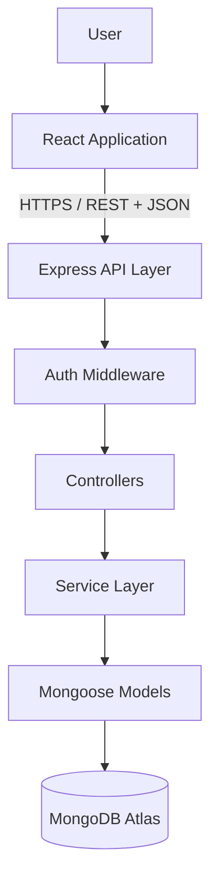
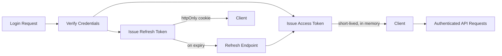
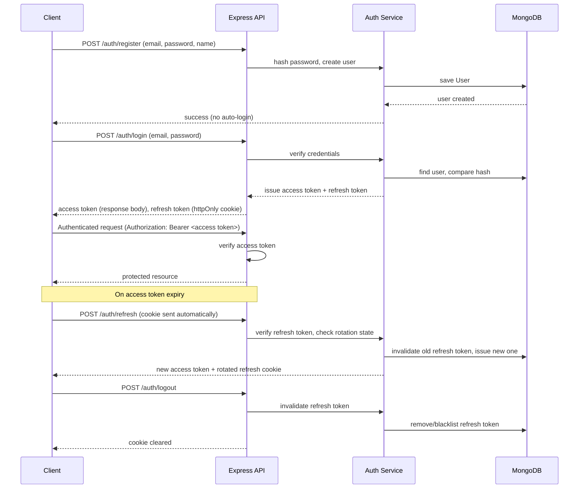
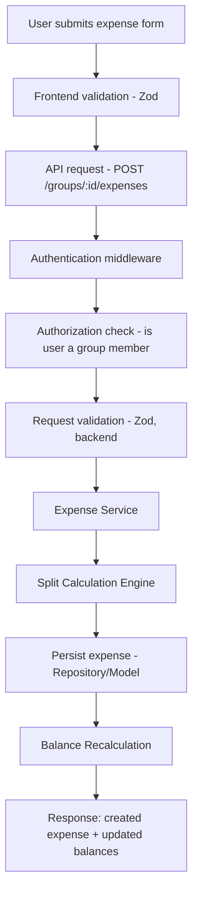
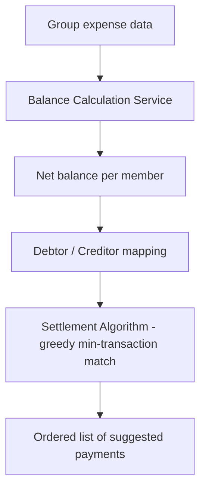

# System Architecture — Expense Splitter (Enhanced)

**Phase:** 1 — System Design
**Milestone:** 1.1
**Status:** Draft
**Depends on:** All Phase 0 documents (frozen)

---

## 1. System Overview

Expense Splitter is a client-server SaaS application: a React single-page application communicating over a REST API with an Express/TypeScript backend, backed by MongoDB. There is no server-rendering layer and no separate BFF (backend-for-frontend) — the frontend talks directly to one authenticated API, consistent with a solo-developer, single-product scope.

**Main system components:**
- **Client (React SPA)** — owns presentation, client-side validation, and UI state.
- **API layer (Express)** — owns request handling, authentication/authorization enforcement, and input validation at the system boundary.
- **Service layer** — owns business logic: split calculation, balance aggregation, settlement computation.
- **Data layer (Mongoose/MongoDB)** — owns persistence and schema-level validation.

**Application boundaries:** the frontend never talks to MongoDB directly and never contains business logic beyond form-level validation (mirrored, not authoritative). The backend is the sole authority on balances and settlement — the frontend only renders what the API returns.



**Authentication flow at a glance:**



---

## 2. Architecture Principles

### Separation of Concerns
Four distinct layers, each with one job: the **UI layer** (React components) renders and captures input, nothing else. The **state management layer** (Redux Toolkit + RTK Query) owns what data exists and where it came from. The **API communication layer** (RTK Query endpoints, Axios where needed outside RTK Query) owns the contract with the backend. The **business logic layer** (backend services) owns every calculation that matters — split math, balances, settlement. No layer reaches past its boundary: components don't compute balances, routes don't contain business logic, and the database is never queried outside the service/repository layer.

### Type Safety First
On the frontend: component props, form schemas (Zod, mirrored into React Hook Form), and RTK Query endpoint types are all derived from a single shared contract shape, so a change to an API response type surfaces as a compile error in the component consuming it, not a runtime surprise. On the backend: controllers, services, and Mongoose models are all typed end-to-end — a service function's input/output types are explicit, and DTOs validated by Zod at the controller boundary guarantee that anything reaching a service is already shape-correct.

### Security By Design
Authentication is enforced at the middleware layer before any request reaches a controller — no route is "accidentally" unprotected. Authorization (does this specific user have access to this specific group/expense) is a separate, explicit check performed in the service layer, not assumed from authentication alone — being logged in proves identity, not access. Sensitive data (password hashes, refresh tokens) never leaves the backend in any API response.

### Maintainability Over Speed
The architecture deliberately avoids three shortcuts that are fast now and expensive later: **fat controllers** (business logic belongs in services, so controllers stay thin — parse request, call service, shape response); **business logic inside React components** (split/balance/settlement logic is backend-only — the frontend never re-implements calculation logic, even for optimistic UI, beyond simple display formatting); and **direct database access from routes** (routes never import Mongoose models directly — everything passes through the service layer, so the data-access pattern can change without touching route definitions).

---

## 3. Application Architecture

### Frontend Architecture

**Structure:** feature-based organization (`features/auth`, `features/groups`, `features/expenses`, `features/settlements`, `features/analytics`), each owning its own components, RTK Query endpoints, and feature-local state. Shared, cross-feature UI (Button, Card, Modal, Skeleton) lives in `components/`. Route-level composition lives in `pages/`, which assemble feature components but contain minimal logic themselves.

**Component hierarchy:** `layouts/` (e.g., `AppLayout` with nav + protected-route shell) wrap `pages/`, which compose feature components, which compose shared `components/`. Data-fetching happens at the feature-component level via RTK Query hooks — pages don't fetch data directly, keeping them thin and swappable.

**State ownership strategy:**

| State type | Owner | Examples |
|---|---|---|
| Server data | RTK Query | groups, expenses, balances, settlements, analytics — anything that originates from the API |
| Global client state | Redux (plain slices) | authenticated user identity, global UI state (e.g., active toast queue, theme) |
| Local/ephemeral state | React `useState` | form input before submission, modal open/closed, which tab is active |

The rule: if the data has a server-side source of truth, RTK Query owns it (and its caching/invalidation) — it is never duplicated into a plain Redux slice. Redux slices are reserved for state that has no server origin. This avoids the classic two-sources-of-truth bug where a Redux copy of server data drifts from what RTK Query's cache actually holds.

### Backend Architecture

**Layered request flow:**

```
Request
  ↓
Routes            — maps HTTP verb + path to a controller, applies middleware (auth, validation)
  ↓
Controllers       — parses/validates request shape (Zod), calls service, shapes HTTP response
  ↓
Services          — business logic: split calculation, balance aggregation, settlement algorithm
  ↓
Repositories/Data Access — encapsulates Mongoose queries, isolates services from ODM specifics
  ↓
Models            — Mongoose schemas, field-level validation, indexes
  ↓
MongoDB
```

**Why business logic belongs in services, not controllers:** a controller's job is to translate HTTP into a function call and a function's return value back into HTTP — it should be replaceable (e.g., if this became a GraphQL API instead of REST) without touching business logic at all. Keeping split/balance/settlement logic in services also makes it directly unit-testable without spinning up an HTTP server or mocking `req`/`res` — which matters specifically for `expenseCalculation.service.ts` and `settleUpAlgorithm.ts`, the two pieces of this system where correctness is non-negotiable.

**Why a repository layer:** isolating Mongoose-specific query code from services means a service asks for "this group's expenses since date X" without knowing or caring whether that's a `find()` call, an aggregation pipeline, or (later) a cached read — the service layer stays focused on business rules, not persistence mechanics.

---

## 4. Data Flow Architecture

### User Authentication Flow



### Expense Creation Flow



Validation happens twice deliberately: frontend validation (Zod + React Hook Form) exists for immediate user feedback, not security. Backend validation (Zod, again, at the controller boundary) is the actual authority — the frontend check is a UX convenience the backend never trusts.

### Settlement Calculation Flow



Settlement is computed on demand from current balances rather than stored as a persistent "pending settlement" state — this keeps it always consistent with the latest expense data, at the cost of recomputing on each request (acceptable given realistic group/expense sizes; see Section 9).

---

## 5. Authentication Architecture

### Token Strategy

**Access Token**
- Short lifetime (minutes, not hours) — limits the damage window if a token is ever exposed (e.g., via XSS), since it expires quickly regardless of explicit logout.
- Held in memory on the client (not localStorage) — deliberately not persisted to any browser storage, so it isn't readable by injected scripts that scan storage, and it disappears on tab close, which is an acceptable trade-off given the refresh flow re-issues it silently.
- Sent as a Bearer token in the `Authorization` header on every authenticated request; verified by middleware before any controller runs.

**Refresh Token**
- Longer lifetime (days) — exists purely to re-establish a session without forcing re-login, not to authorize API calls directly.
- Stored in an **httpOnly, Secure, SameSite cookie** — inaccessible to JavaScript entirely, which is the primary defense against token theft via XSS (an access token in memory is still theoretically exposed to a compromised page; a refresh token in an httpOnly cookie is not).
- **Rotated on every use:** each refresh request invalidates the old refresh token and issues a new one. This means a stolen refresh token has a single-use window — if both the legitimate client and an attacker try to use the same (now-invalidated) token, the reuse is detectable, which is the standard justification for rotation over static long-lived refresh tokens.
- **Logout invalidation:** logout explicitly invalidates the current refresh token server-side (not just clearing the cookie client-side) — clearing the cookie alone would leave a still-valid token usable if it had been copied elsewhere.

**Why access + refresh instead of one long-lived token:** a single long-lived JWT is either too long-lived (large exposure window if stolen, since JWTs can't be server-invalidated individually without a blocklist) or too short-lived (constant forced re-logins, bad UX). Splitting the concern lets the access token stay short and stateless (fast to verify, no DB lookup) while the refresh token — which does require a DB-backed rotation/invalidation check — is used rarely.

---

## 6. Security Architecture Overview

### Frontend Security
- All form input validated client-side with Zod before submission (UX layer, not the security boundary).
- Routes requiring authentication are wrapped in a protected-route component that checks auth state and redirects unauthenticated users before any protected data-fetching occurs.
- No sensitive data (tokens beyond the in-memory access token, password data) is ever stored in localStorage, sessionStorage, or logged to the console in production builds.

### Backend Security
- **Helmet** — sets secure HTTP headers by default (reduces common header-based attack surface).
- **CORS** — restricted explicitly to the deployed frontend origin; not left open (`*`) even in early deployment.
- **express-rate-limit** — applied to authentication endpoints specifically (login, register, password reset) to blunt brute-force and credential-stuffing attempts.
- **Authentication middleware** — verifies the access token and attaches the identified user to the request before any controller logic runs.
- **Authorization middleware/service checks** — separately verifies that the authenticated user has a legitimate relationship to the requested resource (e.g., is a member of the group being accessed) — authentication proves *who*, authorization proves *allowed to*.
- **Request validation (Zod)** — every mutating endpoint validates its body/params shape before it reaches a service, rejecting malformed or unexpected input at the boundary.

### Database Security
- Connection strings and credentials live in environment variables, never committed to source control, and differ between development, staging, and production.
- MongoDB Atlas access is restricted by IP allowlist (or VPC peering in a more advanced setup) and a database user scoped to only the permissions the application needs — not an admin-level credential.
- **Data isolation between groups** is enforced at the query/authorization layer, not by database structure alone: every group-scoped query is filtered by a membership check derived from the authenticated user, so one group's data is never reachable through another group's request context, even if a document ID were guessed.

---

## 7. Expense Splitter Domain Architecture

### Expense Domain

**Entities:** `User`, `Group`, `Expense`, `Settlement`.

**Relationships (conceptual, schema detail deferred to `DATABASE_DESIGN.md`):**
- A `User` belongs to zero or more `Group`s, via group membership.
- A `Group` has many `Expense`s.
- An `Expense` references one payer (`User`) and a set of members it applies to (`splitAmong`), each scoped to the parent `Group`.
- A `Settlement` represents a computed or recorded payment between two `User`s within a `Group` — in V1, settlement suggestions are computed on demand (Section 4) rather than persisted proactively; a `Settlement` record is created when a suggested payment is marked as completed, giving the group a historical record of what was actually settled.

> **Open dependency:** the precise cardinality and deletion behavior of the `User`↔`Group` relationship depends on the soft-removal decision flagged since Phase 0 (Milestone 0.2) and carried through `FEATURE_REQUIREMENTS.md` (FR-008). This document assumes **soft-removal** — a removed member's user reference is retained on historical expenses/settlements even after their active membership ends — consistent with the Team Collaborator persona's audit-trail need. This must be confirmed before `DATABASE_DESIGN.md`, where it becomes a concrete schema commitment.

### Split Engine
Supported calculations: equal, unequal, percentage (Section 3 of `FEATURE_REQUIREMENTS.md`). This logic is isolated in `services/expenseCalculation.service.ts`, entirely separate from controllers, for two reasons: (1) it's the highest-risk correctness surface in the application — isolating it makes it exhaustively unit-testable without any HTTP scaffolding, and (2) it's reused in more than one place (expense creation, expense editing recalculates the same way) — a controller-embedded implementation would either duplicate logic or awkwardly couple the edit flow to the create flow's controller.

### Settlement Engine
- **Input:** the group's current net balances (one signed amount per member — positive if owed, negative if owing).
- **Process:** a greedy debtor/creditor matching — repeatedly identify the member with the largest debt and the member with the largest credit, settle the smaller of the two amounts between them, update both balances, and repeat until all balances reach zero.
- **Output:** an ordered list of minimal-count "who pays whom, how much" suggestions.
- **Complexity:** sorting balances is O(n log n); the matching pass is O(n) since each iteration fully resolves at least one member's balance to zero — overall O(n log n) time, O(n) space for n participants with non-zero balances. This lives in `utils/settleUpAlgorithm.ts`, isolated from the balance-calculation service so the algorithm itself (given any array of net balances) is testable independent of how those balances were derived.

---

## 8. Deployment Architecture

```
Frontend (React/Vite build)  →  Vercel
Backend API (Express)        →  Render/Railway-style container deployment
Database                     →  MongoDB Atlas (managed)
```

- **Environment separation:** distinct `.env` configurations for development, staging (optional, given solo-developer scope — may be collapsed into a single pre-production check), and production — never shared credentials or connection strings across environments.
- **Production variables:** JWT secrets, MongoDB connection string, CORS allowed origin, and any third-party service keys are injected via the hosting platform's environment variable configuration, never committed to the repository.
- **CORS configuration:** production CORS is locked to the deployed frontend's exact origin; development CORS allows `localhost` explicitly, not wildcarded.
- **Logging:** Winston handles structured application logs (errors, auth events, service-level failures); Morgan handles HTTP request logging in development, reduced to error-only logging in production to avoid noisy/unbounded log growth.
- **Monitoring:** for V1, monitoring is limited to platform-level uptime/error visibility provided by the hosting platform itself (Vercel/Render dashboards) — no dedicated APM tool. This is a deliberate scope boundary, not an oversight (see Section 9).

---

## 9. Scalability Considerations

**What's planned for:**
- **Database indexing:** indexes on `Group` membership lookups and `Expense.group` (every expense query is group-scoped, making this the highest-value index), plus `User.email` (unique, used on every login).
- **API optimization:** balance calculation is designed as a pure aggregation over an indexed query rather than N+1 per-member lookups.
- **Horizontal scaling readiness:** the backend is stateless (no in-memory session state — auth state lives in the token itself and the DB-backed refresh token record), which means it can run behind a load balancer across multiple instances without sticky sessions, if that's ever needed.

**What's intentionally NOT implemented in V1** (avoiding over-engineering a solo portfolio project):
- **Caching layer (e.g., Redis):** balance/settlement computation is cheap enough at realistic group sizes (tens of members, hundreds of expenses) that caching would add operational complexity without a corresponding performance need yet.
- **Background job processing:** all calculations happen synchronously within the request lifecycle; there's no current operation (at V1 scope) slow enough to justify moving it off the request thread.
- **Read replicas / sharding:** unnecessary at the data volumes this product's personas realistically produce; a single MongoDB Atlas cluster is sufficient.

These are documented absences, not gaps — reintroducing them later (Section 4 of `VISION.md`'s long-term direction) is a scaling decision to make if and when real usage demands it, not a V1 requirement.

---

## 10. Architectural Decisions Record

### ADR-001 — Monolithic MERN Architecture for V1
**Decision:** Single deployable frontend + single deployable backend, not a microservices split.
**Reason:** Solo-developer, portfolio-scoped project — a monolith is faster to build, easier to reason about end-to-end, and simpler to deploy and demo.
**Alternative considered:** Microservices (separate auth service, expense service, etc.).
**Why rejected:** Adds operational complexity (service discovery, inter-service communication, distributed transaction concerns for balance consistency) with no corresponding benefit at this scale or team size — would actively work against the Maintainability Over Speed principle in Section 2.

### ADR-002 — Service Layer Architecture (MVC + Service Layer, not fat controllers)
**Decision:** Business logic isolated in a dedicated service layer between controllers and data access.
**Reason:** Testability (services are unit-testable without HTTP scaffolding) and reuse (the same split/balance logic is needed by both create and edit flows).
**Alternative considered:** Logic directly in controllers (classic fat-controller MVC).
**Trade-off:** Slightly more boilerplate (an extra layer to pass through) in exchange for isolation and testability — accepted, given that `expenseCalculation.service.ts` and `settleUpAlgorithm.ts` are the project's highest-value-to-test code.

### ADR-003 — JWT Access + Refresh Tokens with Rotation
**Decision:** Short-lived access tokens (in-memory, client-side) paired with longer-lived, rotated refresh tokens (httpOnly cookie).
**Reason:** Balances security (small exposure window, XSS-resistant refresh storage, detectable token-reuse via rotation) against usability (no forced frequent re-login).
**Alternative considered:** Single long-lived JWT; server-side session storage (traditional sessions).
**Why rejected:** A single long-lived JWT can't be individually invalidated without a blocklist, undermining the "revoke on logout" requirement; traditional server-side sessions reintroduce server-side session-state, working against the stateless horizontal-scaling readiness described in Section 9.

### ADR-004 — MongoDB as the Primary Datastore
**Decision:** MongoDB via Mongoose, not a relational database.
**Reason:** Expense and group data is naturally document-shaped and group-scoped (an expense's split data is a small, cohesive nested structure), and MongoDB's flexibility suits the split-type variation (equal/unequal/percentage each shape their split data slightly differently) without requiring a rigid, heavily-joined relational schema.
**Alternative considered:** PostgreSQL (relational).
**Trade-off:** MongoDB requires more application-level enforcement of relational-style integrity (e.g., group membership consistency) than a relational DB would provide natively via foreign keys — accepted, since `DATABASE_DESIGN.md` will define explicit validation and indexing strategies to compensate, and the document-shaped fit for this domain's data outweighs the trade-off.
